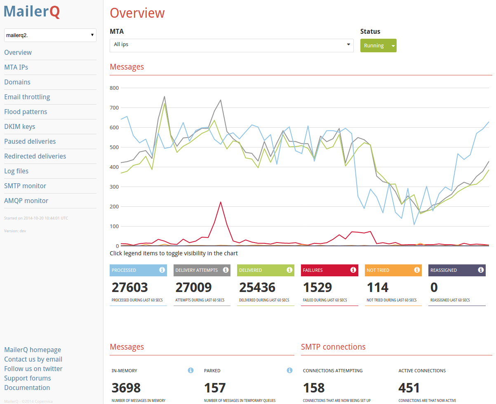
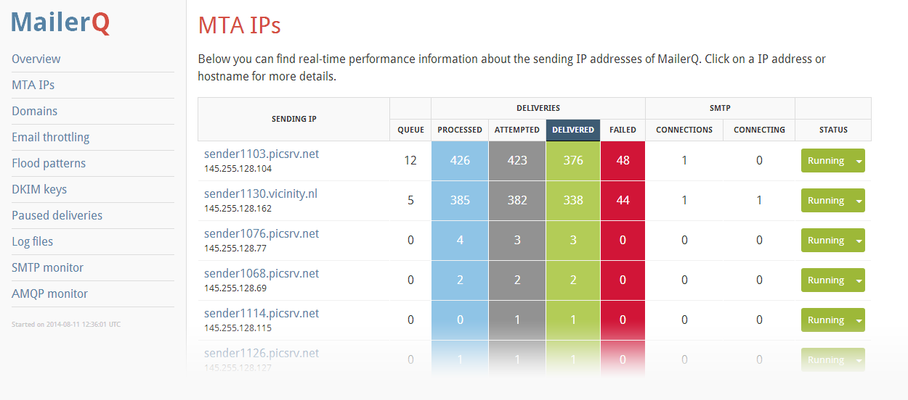
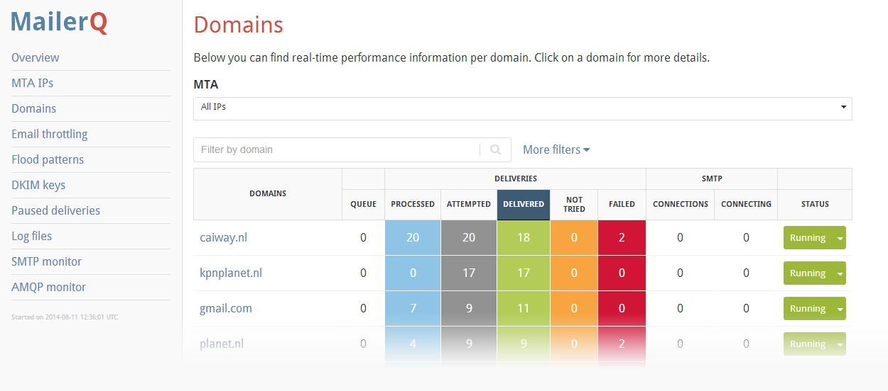
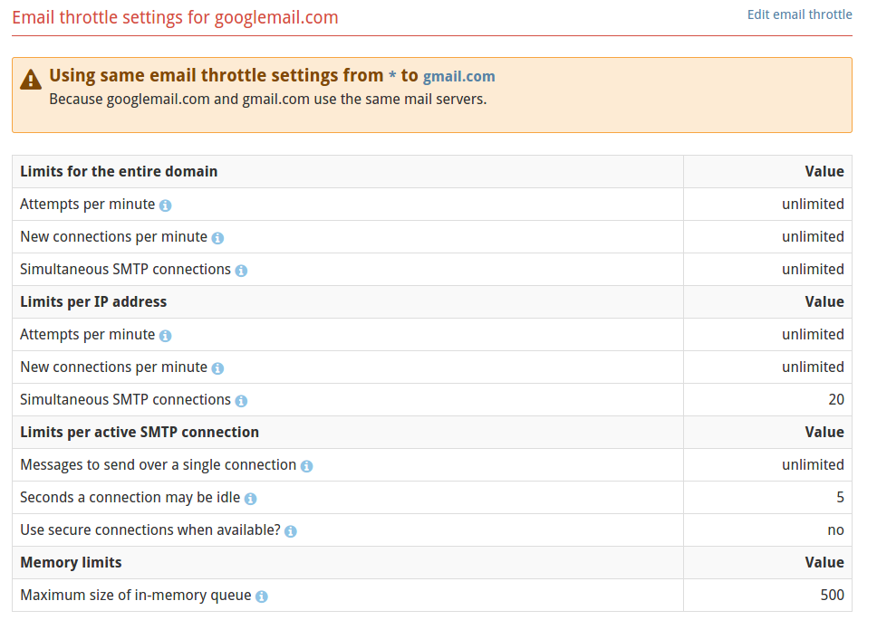
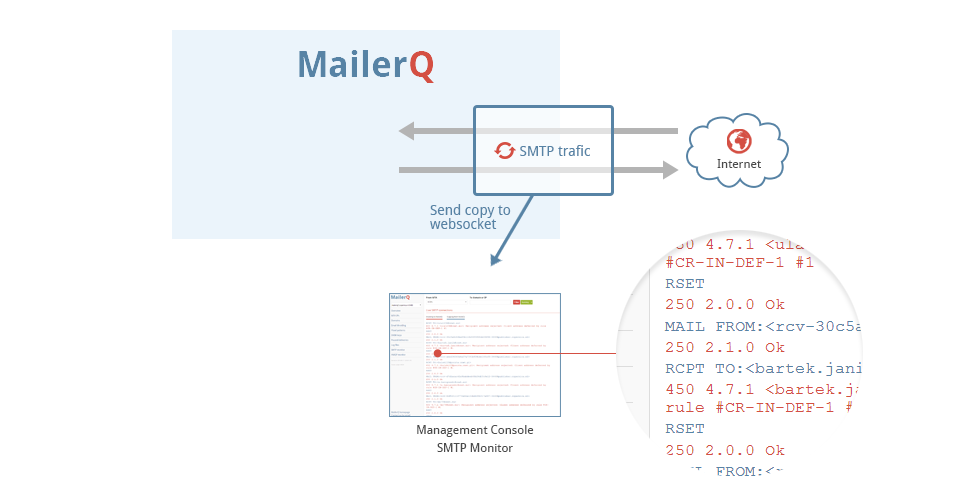

# Mail Transfer Agent Management Console

MailerQ comes equipped with a full MTA management console. The management
console allows you to monitor the performance of your email delivery in 
real-time. If necessary, the management console can be used to change 
settings to maximize deliverability on the fly. If you have multiple 
instances of MailerQ running in a cluster you can easily switch between 
them.


## View the Management Console demo

If you want to see the MailerQ management console in action without 
setting up a MailerQ environment, you can take a look at our 
[Management Console Demo](http://demo.mailerq.com "MailerQ Demo environment").
The data in this environment is fictional, but all settings are available. 
Feel free to play around with the settings and explore the options available.


## Activate the management console

The management console can be enabled in MailerQ's configuration file.
The following variables should be used:

````
www-port:           8485
www-ip:             1.2.3.4
www-password:       admin
www-dir:            /usr/share/mailerq/www
````

The `www-port` variable holds the port number for the management console.
80 is the default. If you use port 8485, you do
not have to include the port number in the URL and you can access the
management console with using a browser via address "http://hostname.of.your.server". 
If you assign a different port number (like 8080), you have to include
the port number in the URL: "http://hostname.of.your.server:8080".

By default, the management console is accessible via all IP addresses that are 
assigned to the server on which MailerQ runs. If you only want to make
it accessible via one specific IP, you can set the `www-ip` variable.
Of course, the IP address that you assign must be bound to the server.

The management console is protected with a password to prevent that 
everyone can access it. This password can be set with the `www-password`
variable. Besides setting a password, we also recommend to put the
management console behind a firewall so that you will not have to worry
about people breaking into it.

All HTML, CSS and Javascripts that are necessary for the management 
console are automatically installed into the "/usr/share/mailerq/www"
directory. If you want to run the console from out of a different
location, you can change this dir with the `www-dir` variable.


## Setting up a secure management console

If is a good idea to secure your management console, as it will also
used to set up private DKIM keys, and such private keys are better
kept private (hence the name) and not transfered over interceptable 
non-secure HTTP connections.

The following configuration file variables are relevant for enabling 
HTTPS support:

````
www-port:                   0
www-secure-port:            443
www-certificate:            /path/to/certificate.crt
www-privatekey:             /path/to/privatekey.key
www-ciphers:                !aNULL:!eNULL:!LOW:!SSLv2:!EXPORT:!EXPORT56:FIPS:MEDIUM:HIGH:@STRENGTH
````

If you enable HTTPS, you can also better switch off the regular HTTP
interface by setting the `www-port` to zero. This prevents that users
will connect to the old unsecure interface by accident. The `www-secure-port`
holds the port number for the HTTPS connections (443 is the default for 
this, so that you won't have to include the port number in URLS). The
certifate and key files, and the supported ciphers can be set using
the `www-certificate`, `www-privatekey` and `www-ciphers` variables.

Once enabled, the encrypted management console can be accessed using
the address "https://hostname.of.your.server" if you use default port 443,
or "https://hostname.of.your.server:port" for any other port.


## Status overview

Once you open the management console. you first get access to the status
over view page. This shows a summary of the email messages passing through
MailerQ. Here you can see how many messages have been processed, delivered,
retried, failed and more. It also shows the number of SMTP connections 
that are currently active and how many are being attempted.




### AMQP monitor

The Overview interface also shows a summery of the messages going through 
your RabbitMQ queues. It shows exactly how many messages RabbitMQ has 
received, the amount of rescheduled messages, the messages in memory and 
the results (success, failure, retries). It also shows the amount of 
active temporary queues.


## MTA IPs

To get a more detailed picture, the MailerQ MTA management console allows 
you to zoom in on per-IP performance. This list is updated in real time.




## Domains

Not every domain likes to receive email at high rates. The domains view 
provides real-time information on per-domain performance e.g. queues or 
failed deliveries. Use this info to make adjustments on the fly for 
example modify email throttle settings.




## Email throttling

Setting up email throttling can be done in the MailerQ Management Console. 
All throttling settings can be adjusted in real-time, making it easy to 
improve your email delivery when needed. You can choose to set up 
throttling settings for a single domain for all IP addresses or for all 
IP addresses.




## Flood patterns

Flood patterns are rules that override the default throttling settings 
of MailerQ when the Mail Transfer Agent receives a specific error from a
receiving mail server.

Read more about setting up flood patterns and other delivery settings in our
[delivery throttling documentation](delivery-limits).

## DKIM keys

MailerQ supports DKIM, Domain Key Identified Mail, a mehtod for email 
authentication. Adding DKIM keys can be easily done in the management 
console.

[Read more about signing email with DKIM](dkim "MailerQ DKIM documentation")

## Paused deliveries

The paused deliveries tab in the Management Console of our Mail Transfer
Agent shows you exactly what email deliveries are currently paused. It 
shows which IP address is paused to which remote IP/domain and until 
when the delivery is paused. You can also manually pause email 
deliveries if necessary.


## Redirected deliveries

Email deliveriy can also be redirected from one IP to another IP. For 
example when one of your IPs is greylisted by a receiving domain. The 
redirected delivery shows all redirecting rules and which delivery is 
currently being redirected. You can also manually set up redirections.


## Log files

Every delivery attempt is registered by MailerQ is saved in the MailerQ
log files. These files can be viewed in the MailerQ management console.


## Live SMTP monitor using web sockets

One of MailerQ's cool features (if we may say so) is the live SMTP 
monitor. By starting up the monitor in the management console, your 
browser opens a [HTML 5 websocket](http://www.websocket.org) to the core
MailerQ process. All SMTP traffic received and sent out by MailerQ is 
also sent to this websocket, so you can exactly keep an eye on what is 
happening to your mailings.



