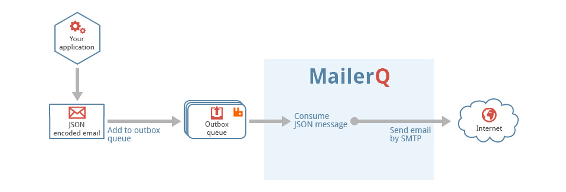

# Pushing emails directly to RabbitMQ

In the end, MailerQ fetches all messages that it is going to send directly
from a RabbitMQ outbox queue. The fastest and most efficient way to inject emails 
is therefore to bypass SMTP, spool directories or the command line interface,
and publish messages directly to RabbitMQ.

If you want to publish messages directly to RabbitMQ, you need a client 
library to communicate with RabbitMQ. On the RabbitMQ website you can
find [many plugins and libraries](http://www.rabbitmq.com/devtools.html) 
for this.



Besides being faster, publishing messages directly into the outbox queue 
has the advantage that you can set all sorts of special properties
in the JSON objects that control the delivery.

## Sending messages

The JSON encoded messages that you add to the outbox message queue should 
contain a minimum of two properties that hold the recipient's email address, 
and the full MIME message. All other properties are optional.

````
{
    "recipient": "info@example.org",
    "mime": "From: my-sender-address@my-domain.com\r\n
             To: info@example.org\r\n
             Subject:Example subject\r\n\r\n
             This is the example message text"
}
````

If you're interested in bounces and out-of-office replies, we recommend
to also include an "envelope" property, because that's the address where
bounces will be sent to. 

````
{
    "envelope": "my-sender-address@my-domain.com",
    "recipient": "info@example.org",
    "mime": "From: my-sender-address@my-domain.com\r\n
             To: info@example.org\r\n
             Subject:Example subject\r\n\r\n
             This is the example message text"
}
````


Note that for ease of reading we added some spaces to the message mimes in the 
above examples. The above examples are very minimalistic, check the
[JSON message specification](json-messages) for a full list of all
supported properties.

## Compression

It is possible to compress the data that you send to MailerQ. The JSON
message that you send to RabbitMQ can be gzip compressed. If you do this,
you also have to add a "content-encoding" header to the AMQP envelope in
which the message is wrapped, and set it to the value "gzip". Check the
documentation of your AMQP library to find out how to set properties in
the AMQP envelope.
