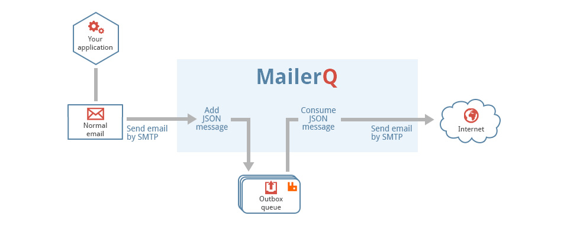

# Management Console: Status overview interface

Once you open the management console, you first see the Status
Overview interface. This shows an overview of the messages that MailerQ has handled in
the previous 60 seconds. By toggling a counter, you can disable the graph that it corresponds to.

The "Connects" counter indicates how many new connections MailerQ has tried to establish, while
the "Attempts" counter indicates how many messages MailerQ has tried to send. Note that the number of
attempts can be higher than the number of "connects", because more than one message can be sent over a single
connection.

The "Deliveries" counter shows the number of attempts that resulted in a successful delivery, while the "Errors" counter shows the number 
of deliveries that got a negative response from the target server. If the ratio of errors to deliveries is high it is advisable
to check the [Domains view](mgmt-domains) to see where these failures are coming from.

The "Strange" counter shows the failures that are more subtle, like timeouts and suddenly lost connections.
These sorts of issues can either be temporary hiccups or busy servers and MailerQ will try to recover from
such issues before marking the domain as being offline.

The "Not Tried" counter is for failures that were generated before any connection was established.
Usually, a high number of not-tries indicates that a domain is offline or is subject to heavy throttling.

In addition to the counters, the overview gives a more detailed overview of the connections that MailerQ is handling:
connections being established, active connections and connections that are waiting for a new delivery.

## Filtering the graph

Selecting a single MTA through the dropdown menu also allows you to rename an 
MTA.  Note that renaming will not affect the MTA hostname; this MTA name is only 
used within MailerQ.

The green "Running" button allows you to pause either the entire application or a specific MTA, which will then
show up in the [Paused Deliveries](management-console#pause-deliveries) view. Do note however that pausing will quickly fill up the RabbitMQ queues.

