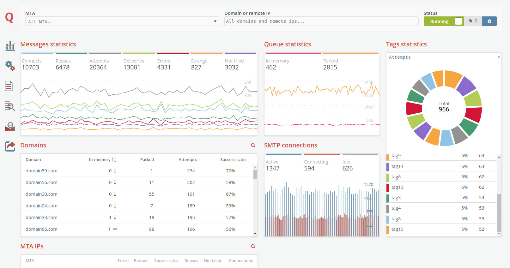

# Mail Transfer Agent Management Console

MailerQ comes equipped with a full MTA management console. The management
console allows you to monitor the performance of your email delivery in 
real-time. If necessary, the management console can be used to change 
settings to maximize deliverability on the fly. If you have multiple 
instances of MailerQ running in a cluster, you can easily switch between 
them.



## Setting up the Management Console

The management console can be enabled in MailerQ's configuration file.
The following variables should be used:

````
www-port:           8485 (default: 8485)
www-ip:             1.2.3.4 (default: 0.0.0.0, meaning all available IP's)
www-password:       admin (empty by default)
www-dir:            /usr/share/mailerq/www (default: /usr/share/mailerq/current/www)
www-connections:    10
````

The `www-port` variable holds the port number for the management console;
8485 is the default. If you use port 80 (which is the default port for HTTP
traffic) you can access the management console with using a browser via 
address `http://hostname.of.your.server`. If you assign a different port number 
(like 8485), you must include the port number in the URL: `http://hostname.of.your.server:8080`.

In its default setting of `0.0.0.0`, the management console is accessible via 
all IP addresses that are assigned to the server on which MailerQ runs. If you 
only want to make it accessible via one specific IP, you can set the `www-ip` 
variable. Of course, the IP address that you assign must be bound to the server.

The management console is protected with a password to prevent anyone from
accessing it. This password can be set with the `www-password`
variable. Besides setting a password, we also recommend to put the
management console behind a firewall so that you will not have to worry
about people breaking into it.

All HTML, CSS and Javascripts that are necessary for the management 
console are automatically installed into the `/usr/share/mailerq/current/www`
directory. If you want to run the console from out of a different
location, you can change this directory with the `www-dir` variable.

To limit the number of resources that can be used by the built-in HTTP
server, you can use the "www-connections" variable to limit the number
of simultaneous HTTP connections that can be handled. This number
includes active web sockets.


## Setting up a secure management console

If is a good idea to secure your management console, as it will also be
used to manage private DKIM Keys; by definition, these should be kept private 
and thus not transferered over interceptable non-secure HTTP connections.

The following configuration file variables are relevant for enabling 
HTTPS support:

````
www-secure-port:            443 (empty by default)
www-certificate:            /path/to/certificate.crt (empty by default)
www-privatekey:             /path/to/privatekey.key (empty by default)
www-ciphers:                !aNULL:!eNULL:!LOW:!SSLv2:!EXPORT:!EXPORT56:FIPS:MEDIUM:HIGH:@STRENGTH (empty by default)
````

If you enable both HTTP and HTTPS, users who access the non-secure interface
will automatically be forwarded to the secure interface. The `www-secure-port`
holds the port number for the HTTPS connections (443 is the default for 
this, so that you won't have to include the port number in URLS). The
certifate and key files, and the supported ciphers can be set using
the `www-certificate`, `www-privatekey` and `www-ciphers` variables.

Once enabled, the encrypted management console can be accessed using
the address `https://hostname.of.your.server` if you use default port 443,
or `https://hostname.of.your.server:port` for any other port.


## Announcing the interface on the cluster

If you have [a cluster with multiple MailerQ instances](cluster),
the web interface of these interfaces contains links to the other instances. 
MailerQ does its best to find out the URL for each of the other interfaces (by 
combining the host names and port numbers), but you can use the following
optional config file variables to help a hand:

````
www-host:               your.hostname (default: auto-detected)
www-url:                https://your.hostname:port (default: auto-detected)
````


## Advanced caching options

The resources for the web interface (like the html, css, and javascript files)
are sometimes cached by your browser. This is normally ok (because you probably
do not update the files anyway), but if you plan to install a new MailerQ 
release once every while, you can set the cache-control header in the config
file:

````
www-cache-control:      must-revalidate
````

This config file option was mainly added to MailerQ to help the MailerQ
web developers: they make changes to the interface all the time, and they 
wanted to prevent that the testers were reviewing an outdated interface. But
in production environments, this setting might be useful too.

Check out [the documentation on mozilla.org](https://developer.mozilla.org/en-US/docs/Web/HTTP/Headers/Cache-Control)
for a list of supported options for this header.

