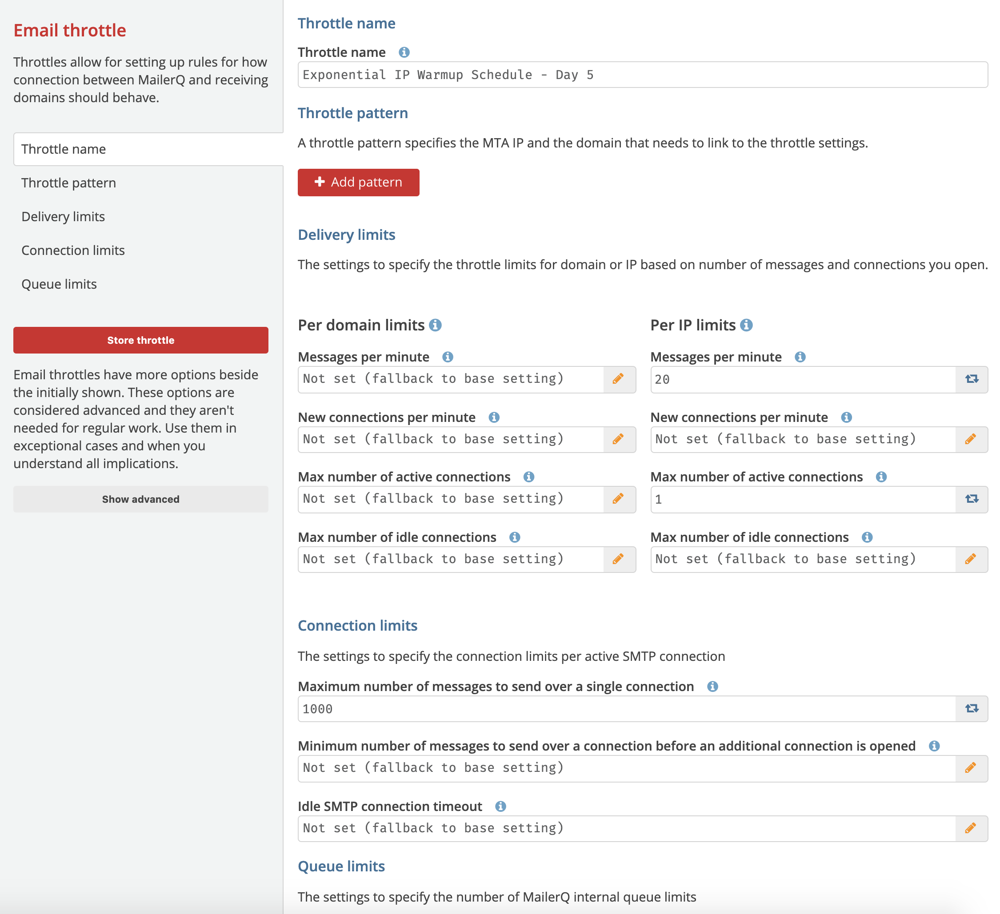
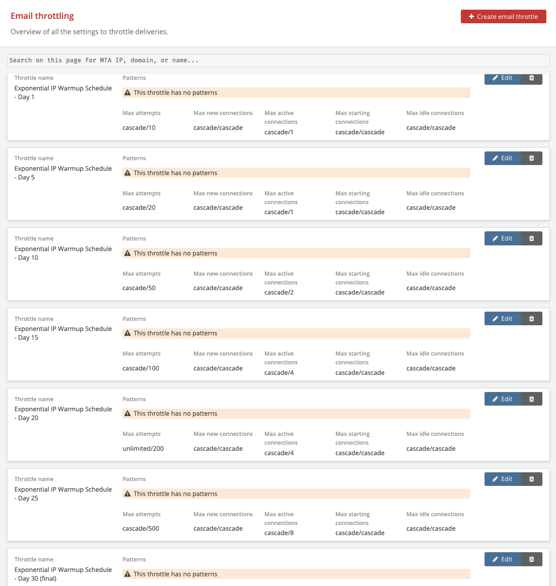
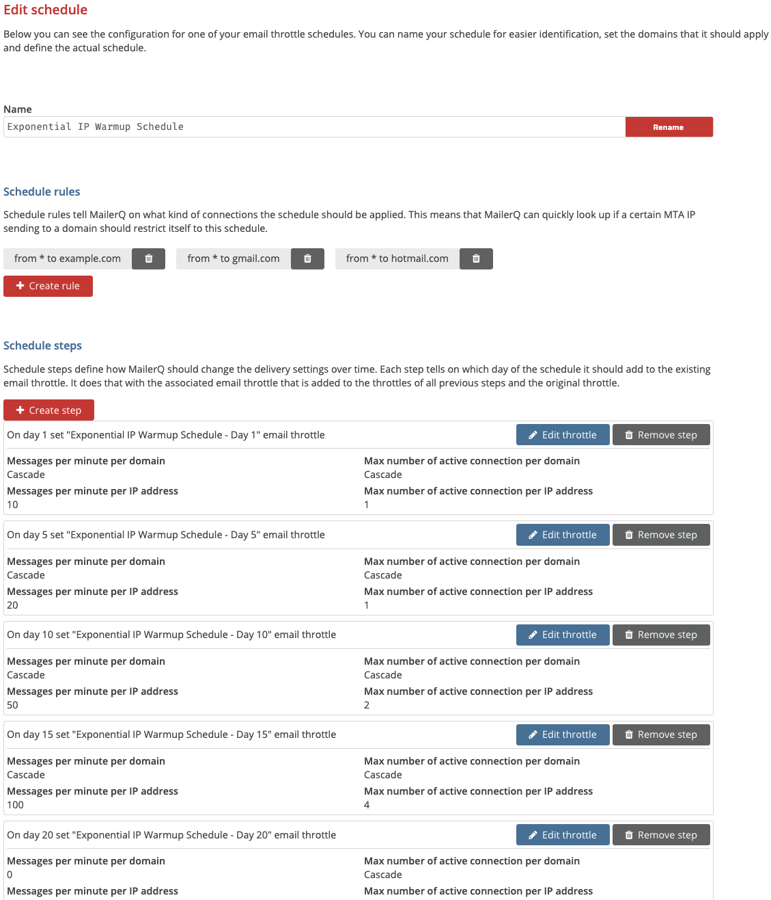

#  Email Throttle Schedules
## What are Email Throttle Schedules?
**Email Throttle Schedules** is a functionality in MailerQ used for warming up IP addresses. When you put a new IP address into operation for sending, mailbox providers will initially be hesitant to accept large volumes of email from it. It is therefore important to gradually increase your sending speed and volume, a process also known as IP warm-up. This process allows mailbox providers to identify you as a legitimate sender. Warming up an IP address will minimize deliverability issues and maximize the results of your email campaigns. This warming up can easily be done with Email throttle schedules.

## What are IP warm-up possibilities in MailerQ?
MailerQ IP warm-up is a two-step process using features *Email throttles* and *Email throttle schedules*. MailerQ allows you to set a pattern of which IPs to which ISPs you want to warm up as well as set a specific schedule. There can be a lot of different ways to specify your schedules, for example, for general use, for a certain ISP, an exponential warm-up schedule, a linear schedule etc. These schedules can be reused and changed for every new IP address that you are adding according to your needs and requirements. 

Once you successfully go through setting up Email Throttle Schedules, MailerQ will recognize the patterns and steps you created and start sending. The schedule day parameter will be incremented once per day for every combination of an IP to a domain it has sent that day.  That means that day 1 starts when the specific messages match the pattern combination (IP to ISP) and will move to the next scheduled step only once actual messages have been sent out. If you don't send any messages on a certain day, the schedule will not advance to the next step.

## How to set up Email Throttle settings in MailerQ?
First, we'll have to figure out what an appropriate IP warm-up plan is for the ISPs we're creating a warm-up plan for. We'll need to know how long warming up a cold IP address at a certain ISP takes, and how your sending volume should increase over that period of time. In this tutorial, we'll go with a dummy plan that is not per se usable in real-life scenarios. For smaller mailbox providers and as a fallback plan, we recommend creating a default schedule. MailerQ's team of Deliverability Experts is happy to assist in figuring out the right warm-up plans. 

EXAMPLE ONLY: *Exponential IP warm-up schedule* for 30 days, increasing the throttles every 5 days:

### Step 1: Creating Email Throttles for IP warm-up 
Once we know how to warm up our cold IP(s) at a certain ISP, we'll have to create new Email Throttles for each step/increment (for this example day 1-4, day 5-9, day 10-14, and so on). We will need to create 7 *Email Throttles*. Make sure to not specify a pattern in these Email Throttles.  An advanced description on how to use Email throttles can be found [here](https://www.mailerq.com/user-guide/article/email-throttling). 

In the MailerQ Management Console:
1. Email throttling settings in MailerQ can be easily accessed through the Setting menu page (left side menu bar) > *'Email Throttling'*. Here, you can view, edit existing, and create new Email Throttles. Once you have added Email Throttles, they will appear in this panel. 
2. Click on the *'Create email throttle'*, a new window will appear, with a lot of choices and options.
3. Adjust throttle settings:
	- Specify a name to easily recognize the specific schedule and a day, in this example *'Exponential IP Warmup Schedule - Day 1'*. 
	- We will not add a source IP and target domain pattern here as that is added during the later step in the Schedule rules.
	- Now we set the values that would be used during the first warm-up step/increment. Those will probably be relatively  low as this is the start of the warm-up. 

Image 1: Email throttle: Exponential IP Warmup Schedule - Day 1
	
   - When you are finished, store the throttle

4. Proceed to create a new Email Throttle following similar steps: give it a recognizable name that would match the specific warm-up and a day in the schedule, e.g continuing with our example, the next step is called *'Exponential IP Warmup Schedule - Day 5'*. Again you don't want to set the throttle pattern here as that will be added in the Email Throttle Schedules, but continue to add the settings, this time increasing the values, like in the image below.

Image 2: Email throttle: Exponential IP Warmup Schedule - Day 5

5. Once finished, store the throttle. Follow this procedure by creating another 5 Email Throttles for days 10, 15, 20, 25, and 30 (final). Each time increasing the values according to the ISP requirements and traffic nature. In our example we increase it to form an exponential value growth for the messages. In the end you should have 7 Email Throttles, as in the image below:

Image 3: Seven Exponential IP Warmup Email throttles 

### Step 2: Creating new Email Throttle Schedules and steps
1. Proceed to the Email Throttle Schedules (Settings > *'Email Throttle Schedules'*)
2. Add a new schedule by pressing on the *'Create schedule'* button. 
3. Give that schedule a recognizable name, such as *'Exponential IP Warmup Schedule'*. Now you can edit the schedule and specify different rules and steps. 
4. Create the steps of the schedule (these could be consecutive days or larger periods of times like in our given example):
	- Create a step and specify the *'Day of the Schedule'* and a specific *'Email throttle'*.
	- Match *'day 1'* with the Email Throttle *'Exponential IP Warmup Schedule - Day 1'*. Create the next step of *'day 5'* with the Email Throttle *'Exponential IP Warmup Schedule - Day 5'* and so on. 
	- You have now made an IP warm-up schedule that will automatically increase your sending based on the timeline you specified. 

### Step 3: Warm-up cold IP addresses
Now that we have our warm-up schedule set up, we want to try it out with a cold IP address. You can easily instruct MailerQ to warm up a new IP address using a certain schedule. 
1. On the Email Throttle Schedules page, click on *'Edit'* for the Schedule you'll want to use for the new IP address. In that screen (the same screen as where you can specify the steps), you'll see a button for creating a new schedule rule. This button will open a screen that lets us specify an IP address to warm up and a target domain.
2. Here you can create multiple steps if you would wish to use the schedule for many domains, as shown in the *Image 4* below. In this example we will use the exponential schedule to send from all IPs to orange.fr, gmx.de, web.de and att.net. (It is important to remember that domain aliases (domains with similar MX records or similar MX IP addresses) are automatically recognized, so it won't be necessary to list all known aliases.

Image 4: Seven Exponential IP Warmup Schedules - Day 1,5,10,15,20,25 and 30

At the end of the schedule the specified IPs will remain on the last determined Email throttle capacities. At this point you could either determine the last step to be matching the capacities specified by ISPs or you could move the IPs over to your other email throttle rules.

For questions and suggestions on the specific use case of Email throttle schedules, feel free to reach out to one of our experts via [info@mailerq.com](mailto:info@mailerq.com)

