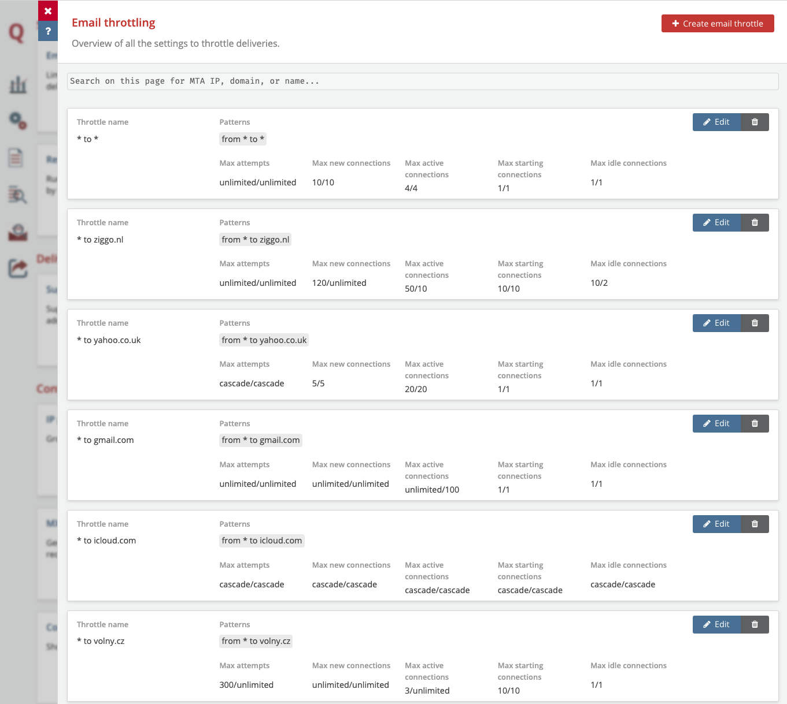

# Email Throttling

## What is Email Throttling?

**Email Throttling**  is the process of controlling the sending capacities of emails delivered to mailbox providers. 

Receiving mail servers almost always limit the traffic that they will accept from a certain source. If too many of your emails or connections are rejected this might result in a temporary block, which in turn can have a negative effect on your reputation and deliverability. That is why it is important to *throttle* your email.

## What are throttling possibilities in MailerQ?

MailerQ offers granular control on sending capacities that you can specify with email throttles. You can specify the number of connections and delivery rates for specific combinations of source IP and target domain. Examples of capacities that can be set here are messages per minute, new connections per minute, bytes per minute, the maximum number of active simultaneous connections, timeouts throughout the SMTP handshake and much more. These rules will automatically apply to all target domains with matching MX records.

### The limits for the Domain and IP can be configured through: 

- the messages and bytes that you send per minute;
- new connections per minute;
- the maximum number of active, starting, and idle connections. 

### Limits for active SMTP connections can control:

- the maximum number of bytes or messages sent over a single connection;
- the minimum messages sent over a connection before an additional connection is opened;
- idle SMTP connections timeouts;
- number of seconds a remote IP is marked as offline after a connection;
- SMTP connection security;
- spreading messages over multiple connections.

### Further settings involve:

- Connection settings:
	- SMTP connection security;
	- Spreading messages over multiple open connections;
	- Bind error handling;
- Setting queue limits;
- Greylisting;
- Specifying SMTP timeouts;
- Handling unexpected behaviors.

These settings are then applied to a 'Throttle pattern' which is a combination of MTA IP (or pool) and/or a domain that needs to link to the throttle settings. Important thing to note is that domain aliases (domains with similar MX records or similar MX IP addresses) are automatically recognized, so you do not have to list all known aliases.

## How to set up Email Throttle settings in MailerQ?

### Accessing and setting Email Throttles via the Management Console:

- Make sure your MailerQ instance is running.
- Open MailerQ Management Console.
- Click on the Setting menu page (left side menu bar) > *'Email Throttling'*. New throttles will be listed here for overview or editing (Image 1).

Image 1: Management Console: Email Throttling overview page (example)

### Creating a new Email Throttle via the Management Console:

1. Once on the Email Throttle overview page, click on *'Create email throttle'*, a new window will appear, with a lot of choices and options. 
(You will see all fields with *'Not Set (fallback to base setting)'*. If a value is *'Not set'*, it will fall back to the less specific settings, or to our default settings. You can view the default values here1.)
2. Create a throttle name:
Specify a recognizable throttle name or description (eg.* 'All IPs to gmail.com'*)
3. Add a throttle pattern: 
	- Specifying from which MTA IP address (or IP Pools) to which domain this throttle will be linked. 
	- Leaving any field blank will result with an "all" value, which means sending will happen from all unspecified IPs and/or to all unspecified domains. This "all" value is represented with an asterisk ("\*\"). 
	- You can add multiple patterns to the same email throttle. Note that domain aliases (domains with similar MX records or similar MX IP addresses) are automatically recognized, so it won't be necessary to list all known aliases.
4. Specify Delivery limits:
	- for the entire domain which are applied to a combination of each of the sending IPs selected in the throttle patterns and the whole domain (or domain group) selected in the throttle patterns
	- for a single IP address behind the MX records of each domain selected in the throttle patterns.
5. Specify connection limits per active SMTP connection
6. Specify MailerQ internal queue limits. This allows you to balance the Quality of Service between retried messages and first attempts and between different ISPs.
7. Click on the *'Show advanced'* button to open a larger, more granular setting choices including new entries for the *'Delivery limits'* section such as *'Bytes per minute'*, (which can be useful with some recipients, e.g. Eastern European ISPs)  *'Max number of starting connections'*. But also further entries in *'Connection limits'* section to specify finer SMTP connection limits as well as:
	- 'Connection Settings'
	- 'Greylisting'
	- 'SMTP timeouts'
	- 'Unexpected behaviors'
8. Click on the *'Create throttle'* button to create and store the new email throttle and move to the Email throttle overview page. From the overview page you can shift the throttles to organize and prioritize them. If there are conflicting settings, the one higher on the list will be applied. From here you can delete the throttles or edit them instantaneously.

For suggestions on best delivery results to specific ISPs, feel free to reach out to one of our experts via [info@mailerq.com](mailto:info@mailerq.com).

