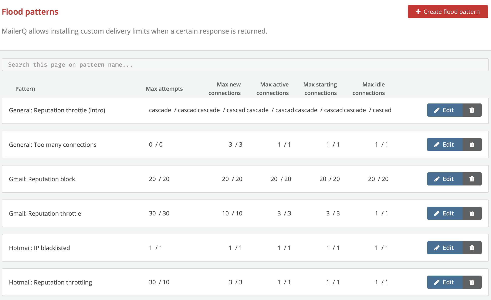
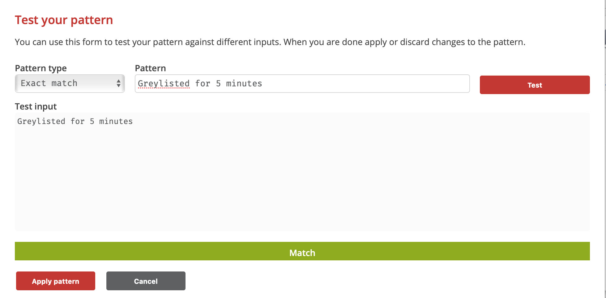
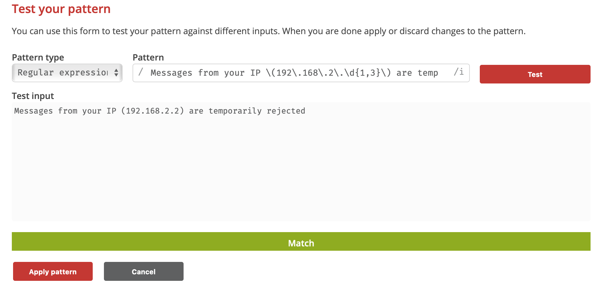
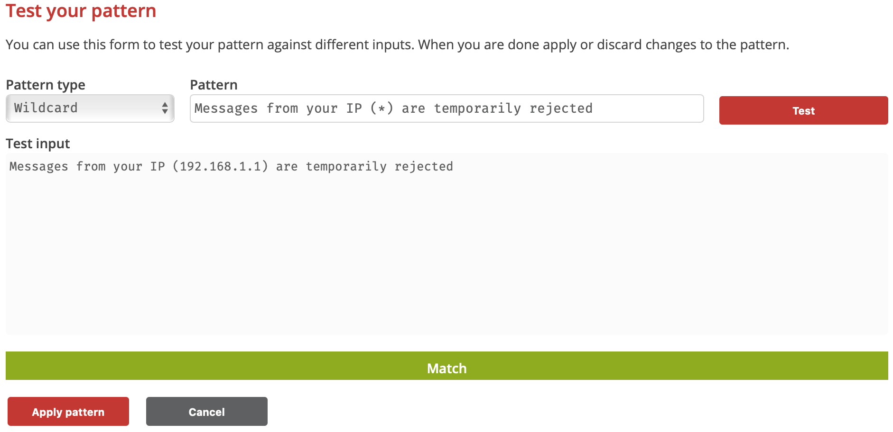
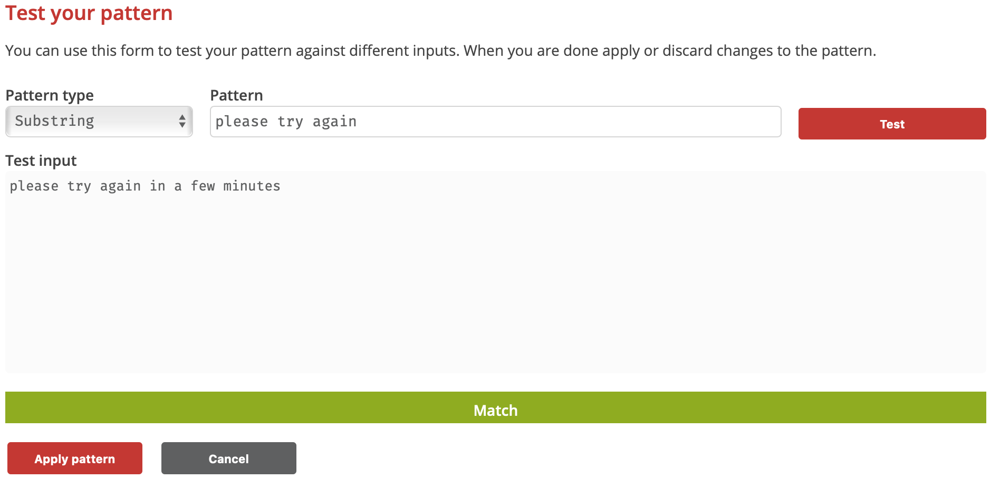

# Flood Patterns
## What are Flood Patterns?
Flood Patterns is a feature in MailerQ which allows you to temporarily override existing Email Throttle settings when a specific server response is received. Whilst Email Throttling most of the time can make sure you do not go over the limits set by receiving parties, it will not stop mail servers from greylisting you completely. However, when you do go over the limits, the receiving mail server often gives a specific response, such as *"too many connections from your ip"*. MailerQ allows you to set Flood Patterns that activate when you get a specific response so you can temporarily pause or slow down your email delivery.

## What are Flood Pattern possibilities in MailerQ?
Defining *Flood Patterns* is very similar to Email Throttling. Whereas Email Throttling is used to proactively define capacities, with Flood Patterns you can temporarily pause communication and then start sending again on a reduced capacity based on server responses (such as *"temporarily rate limited due to IP reputation"*). This pattern can be a substring, wildcard string or regular expression. Once successfully created, the Flood Patterns will automatically adjust your Email Throttles with the settings specified based on specific server responses.

## How to set up Flood Pattern settings in MailerQ?
### Accessing and setting Flood Patterns via the Management Console:
- Make sure your MailerQ instance is running.
- Open MailerQ Management Console.
- Click on the Setting menu page (left side menu bar) > *'Flood Patterns'*. New patterns will be listed here for overview or editing (Image 1).

Image 1: Management Console: Flood Pattern overview page

#### Creating a new Flood Pattern via the Management Console:
1. Once on the Flood Pattern overview page click on the *'Create Flood Pattern'* button. The new page will give you almost the same settings as the *'Email Throttle'* page, with a few extra options to specify a pattern and a duration of activity for these settings. 
2. Specify a *'Flood Pattern name'*, which you can use to easily recognize and understand, (eg. *'General: Greylisted for 5 minutes' or 'Hotmail: IP blacklisted'*).
3. Choose the pattern type: *Exact match, Regular expression, Wildcard or Substring*. There is also a form available under the *'Test pattern'* to test your pattern against different inputs. Below are a few examples of server responses and how you would use different patterns to match them:

	A. Greylisted for 5 minutes - **Exact match**
	

	B. Messages from your IP \(192\.168\.2\.\d{1,3}\) are temporarily rejected - **Regular expression**
	

	C. Messages from your IP (\*\) are temporarily rejected - **Wildcard**
	

	D. Message deferred: please try again in a few minutes - **Substring**
	

4. Once the pattern text is tested click on the *'Apply pattern'* button.
5. Fill in the next two fields that would be appropriate for the corresponding server response. *'Pause communications (seconds)'* allows you to set the time for how long the pause shall be applied once the response pattern matches. 
6. *'Reduced capacity duration (seconds)'* is the time for how long these reduced sending throttle settings shall be applied. For example, if the server response is a type of  *'mail limit reached'*, then it would be wise to pause communication (e.g. 60 seconds) and send in reduced capacity for another 60 seconds.
7. The final step is to specify the sending capacity that should be applied when the specified response is received. Follow the same procedure as you did to set up Email Throttles, but with values that would respect the specific server response condition. An advanced description on how to use Email Throttles can be found here .
8. Once finished, click *'Store Flood Pattern'* and proceed to create new Flood Patterns or other features on the settings page.

For questions and suggestions on the specific use case of Flood Patterns, feel free to reach out to one of our experts via [info@mailerq.com](mailto:info@mailerq.com).

