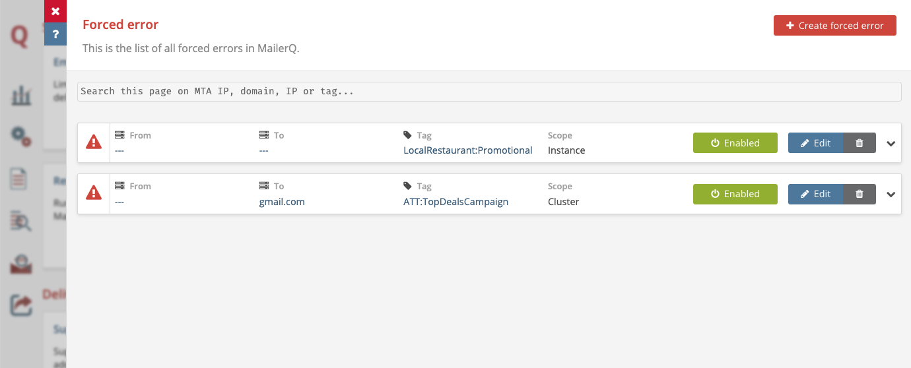

# Forced Errors
## What is the Forced Errors feature?
If you want to completely block certain deliveries and don't plan on sending them at a later moment, you can force MailerQ to return an error whenever such a delivery is attempted. The Forced Error functionality in MailerQ is often used by MTA administrators and deliverability managers to cancel individual problematic deliveries (for a certain ISP) or deliveries that were accidentally sent out. Deliveries blocked in this way will be removed and a custom error will be reported to the result queues and the logs.  This can be specified based on a combination of sending IP or IP Pool, target domain, and tags (many-to-many labels, used for identifying individual or organized deliveries such as "campaign_X", "customer_Y" or "transactional"), either manually through the Management Console or programmatically through the REST API.

## How to set up Forced Errors in MailerQ?
### Via the Management Console
- Make sure your MailerQ instance is running.
- Open MailerQ Management Console.
- Click on the Setting menu page (left side menu bar) > *'Forced Errors'*. Created Forced Error rules will be listed here for overview or editing. (Image 1) 

Image 1: Forced Errors in the Management Console

#### Configure via the settings page
1. Once on the Forced Error overview page click on the *'Create Forced Error'* button. A new window will appear to specify trigger conditions.
2. Make a selection of MTA IPs (or IP pools), target domain or IP address, and a tag to specify which deliveries would trigger an error and would not be attempted to be sent out. 
3. You can specify an error code and an extended error code you want to be shown as well as a description for blocking that message. 
4. Check the box to apply this condition across the whole cluster.
5. Click on *'Create'* to activate the rule and you will be returned to the Forced Error overview page. Here you can enable/disable, edit and delete created conditions.

### Via the REST API
You can also add or remove Forced Errors and get a list of all Forced Errors using the REST API. This enables authorized external applications - such as third party deliverability monitoring tools or your own customer- facing platform - to cancel specific deliveries on the MTA level, even after the message has been queued. The most up-do-date documentation can be found [here](https://www.mailerq.com/documentation/5.9/rest-api-v1-errors).

For questions and suggestions on the specific use case of Forced Errors, feel free to reach out to one of our experts via [info@mailerq.com](mailto:info@mailerq.com).