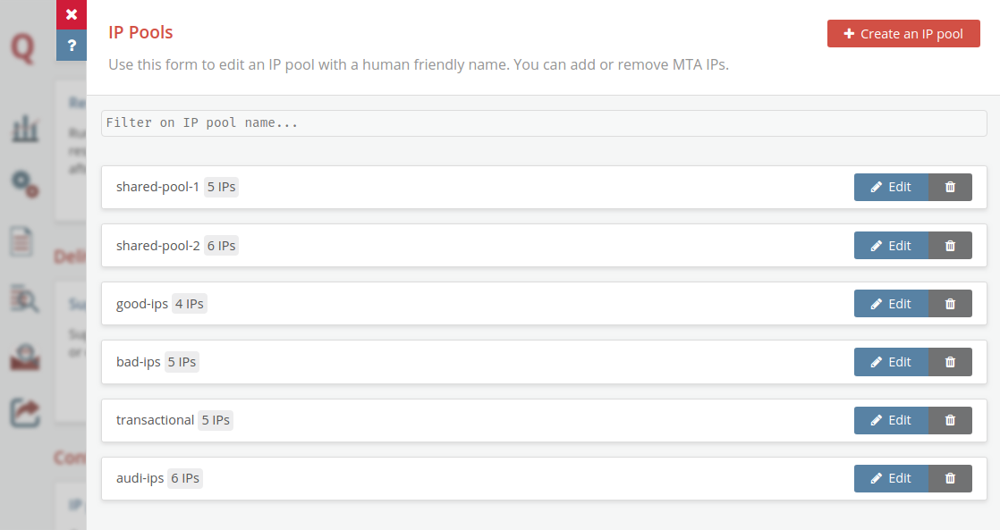

# IP Pools
## What are IP Pools?
**IP Pools** are one-to-one groups of IP addresses that can be referenced by a specific name. This allows you to organize your IPs for different uses, such as shared and dedicated pools for clients, pools for transactional or bulk mailings, and so on. In some other MTAs, this functionality is known as “virtual MTAs”. You can specify per message what IP Pool should be used for sending out the message. This is an alternative to specifying what IP addresses can be used per message. IP Pools can be updated on the fly without requiring a reload. 

## How to set up IP Pools in MailerQ?
### Via the Management Console
IP Pool settings can easily be accessed through the side menu bar in the web-based Management Console. Under *Configuration*, you can click on the *‘IP Pools’* button, which will open a panel that allows you to view, edit existing, and create new IP Pools (Image 1). The name must be unique and alphanumeric since this will be used to reference the pool upon message injection. Once you have added a new IP Pool, it will be listed here. When you click on the *‘Edit’* button for an IP Pool, you can add or remove IPs in that pool on the fly. IPs can only be in a single IP Pool at the same time. If you add an IP to the pool that is already in a different pool, it will be removed from that other pool.

Image 1: IP Pools overview page

### Via the REST API
It’s also possible to configure IP Pools via the REST API. This can be used to automate onboarding, for example. The latest documentation on this can be found [here](https://www.mailerq.com/documentation/5.9/rest-api-v1-pools) 
