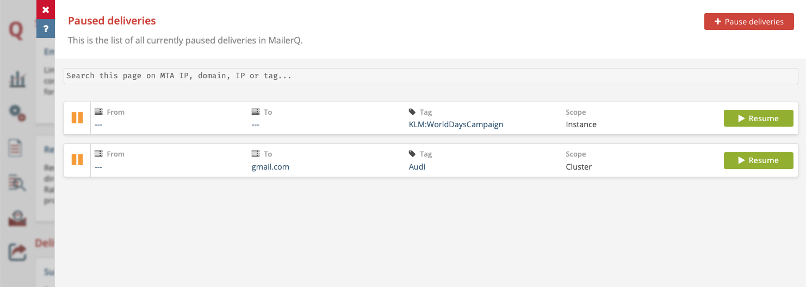

# Paused Deliveries
## What is the Paused Deliveries functionality?
As the name suggests, with **Paused Deliveries** you can suspend certain ongoing deliveries. A message selection to be paused can be made based on a combination of sending IP or IP Pool, destination domain, and tag (many-to-many labels, used for identifying individual or organized deliveries such as "campaign_X", "customer_Y" or "transactional"). If there is an issue with some deliveries, for example the latest campaign by one of your clients is getting a lot of spam complaints at Outlook, you may want to temporarily stop MailerQ from sending that campaign to Outlook so you can investigate the issue.  The overview in the Management Console shows you exactly what email deliveries are currently paused and gives you the option to resume them. New Paused Deliveries can be added on the fly via the Management Console or through the REST API. When using MTA IPs and domains, note that you can use a wildcard "\*\" to indicate that deliveries from (or to) all IPs should be paused. The entire application can be paused by setting both the source and target to a wildcard.

Pausing deliveries gives MTA administrators or deliverability managers additional time to figure out what is going on without continuing sending and damaging reputation. It will allow you to resolve the issue either within MailerQ, for instance using Rewrite Rules, or outside. After the issue is resolved, you can resume sending without a problem. Note that this can be done both for an individual MailerQ instance or all instances in the cluster.

## How to use Paused Deliveries in MailerQ?
### Via the Management Console
- Make sure your MailerQ instance is running.
- Open the MailerQ Management Console.
- Click on the Setting menu page (left side menu bar) > *'Paused Deliveries'*. Any active pauses will be displayed here. (Image 1) 

Image 1: Paused Deliveries in the Management Console

#### Configure via the settings page
1. Once on the Paused Deliveries overview page click on the 'Pause deliveries' button. A new window will appear to specify pausing conditions.
2. Make a selection of MTA IPs (or IP pools), target domain or IP address, and a tag to specify which deliveries you would like to pause. Selecting one field and leaving others empty, e.g. selecting only the target domain as gmail.com, will result in all deliveries targeting this domain to be paused, no matter which IP (or IP pool) or tag is the delivery under. 
3. Click on *'pause'* to activate the rule and you will be able to see the pausing immediately in the overview page. 
4. When you are finished with the necessary checks you can resume the delivery by pressing on the *'Resume'* button on the Paused Deliveries overview page.

#### Configure via the overview dashboard
1. Once on the overview dashboard, you can use the *'Status'* bar on the top right corner to track and interact with delivery intercepts (Paused Deliveries and Forced Errors). The number of active intercepts are shown here and by pressing on them or the settings icon next to it you can access an overview page of all active intercepts.
2. You can also immediately pause all deliveries on the current view (based on the values in the three dropdown boxes at the top for MTA IP, target and tag) by simply pressing the green 'Running' toggle on the top right side. If all dropdowns are not set, all deliveries in the MTA will be paused.

### Via the REST API
You can also add or remove Paused Deliveries and get a list of all Paused Deliveries using the REST API. This enables authorized external applications - such as third party deliverability monitoring tools - to automatically pause a campaign based on a certain trigger. The most up-do-date documentation can be found [here](https://www.mailerq.com/documentation/5.9/rest-api-v1-pauses)

For questions and suggestions on the specific use case of Paused Deliveries, feel free to reach out to one of our experts via [info@mailerq.com](mailto:info@mailerq.com).
