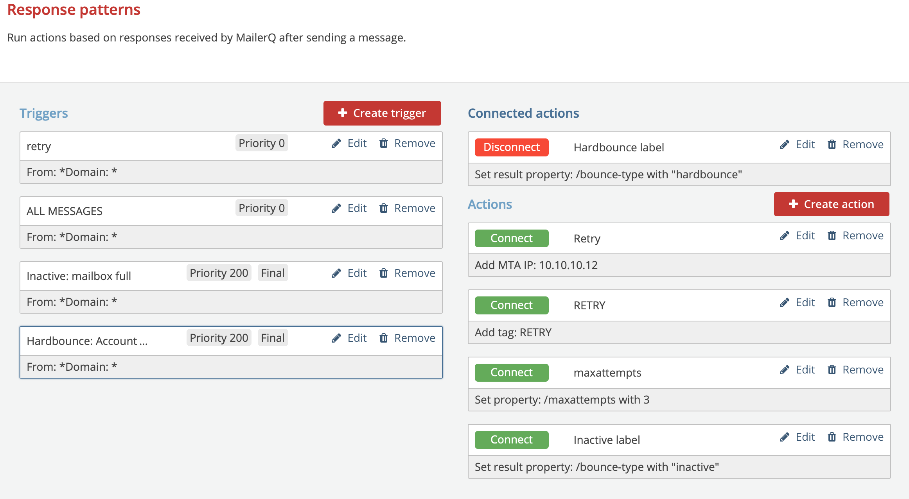

# Response Patterns
## What are Response Patterns?
**Response Patterns** is a feature in MailerQ that allows you to modify message properties and actions per message based on server responses.

When sending a message, MailerQ connects to the SMTP server of the recipients' domain. During sending, a (temporary) failure may occur, indicated by an SMTP reply and status code. Using *Response Patterns*, MailerQ can react to these server responses. *Response Patterns* consist of a *Trigger* specifying when certain actions should be applied, and Actions that should be performed. Example use cases are tagging messages encountering particular errors, rerouting messages upon certain responses, overriding the retry interval upon certain responses, retrying a message when a permanent failure was incorrectly indicated, or stop retries when a temporary failure was incorrectly indicated.

## What are Response Pattern possibilities in MailerQ?
Using **Response patterns**, you can adapt MTA behaviour based on server responses. You can define a Trigger, being a combination of a message selection based on:
Source IP
Target domain
Tag
And a server response pattern (exact match, substring, wildcard or regular expression). 
For every **Trigger**, you can add one or more suitable follow-up Actions such as:
Adding or removing IP addresses for the matching deliveries
Fail or retry the delivery
Adding or removing tags
Modify any of the message object properties
Modify any of the result object properties
Once successfully created, the Response Patterns will automatically perform actions on the messages based on your settings.

## How to set up Response Pattern settings in MailerQ?
### Accessing and setting Response patterns via the Management Console:
Make sure your MailerQ instance is running.
Open MailerQ Management Console.
Click on the Setting menu page (left side menu bar) > *'Response patterns'*. Once you have added new *Triggers* and Actions, they will appear and be listed here for overview and editing. (Image 1) 

Image 1: Management Console: Response patterns overview page

#### Creating a new email throttle via the Management Console:
##### Step 1: Create a trigger
From the Response pattern overview page, click on the *'Create trigger'* button. The new window will pop up to specify the conditions for which you want to trigger certain actions. 
Specify the name to easily recognize the specific trigger (eg. *'Mailbox unavailable'*)
Specify the responses that should be matched. This consists of MTA IPs, target domains and a pattern matching a non-delivery response that will trigger a certain action. (ex. A trigger of All MTA IPs, when sending to gmail.com, matching a *'mailbox unavailable'* pattern.) Note that you can match patterns as a *substring, exact match, wildcard or regular expression*.
Specify the priority of this trigger (lower number equals higher priority) and if other triggers should also be evaluated for the message after this trigger.
Click on *'Create trigger'* to store the trigger and return to the Response pattern overview page.

Proceed to create new triggers or create and link certain actions.

##### Step 2: Create an action
From the Response pattern overview page, click on the 'Create action' button. The new window will pop up to specify what actions you want to take when a certain trigger has been matched.
As you notice there are a lot of actions that you can perform on a message, for example:
Setting custom properties on the result JSON which can give you better insights when processed from the result queues
You can set, remove and add IP addresses per message based on server responses
Add a tag to your messages to keep track and create follow up actions based on that tag
Failing or retrying message delivery.
Click on the *'Create action'* button to store the action and return to the Response pattern overview page. 

Proceed to create new actions or to link the triggers and actions.

##### Step 3: Linking triggers to actions
When you have created triggers and actions you can link them so that a specific action is executed once a trigger has been matched. You need at least 1 trigger and 1 action to link them. You can also link a single trigger to multiple actions.
Select a trigger by clicking on it which you want to connect to an action
Once a trigger is selected, 'Connect' buttons appear next to all created actions. Simply click on the 'Connect' button of the action you would like to link to that trigger. Note, you can connect multiple actions. 
You can disconnect any action with the same procedure.

For questions and suggestions on the specific use case of Response patterns, feel free to reach out to one of our experts via info@mailerq.com.

