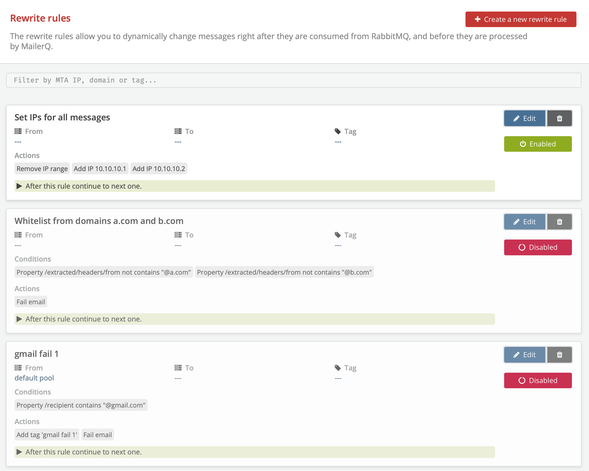

# Rewrite Rules
## What are Rewrite Rules?
**Rewrite Rules** can be used to dynamically identify and reroute messages prior to a delivery attempt. Rewrite Rules can modify message metadata right after pickup and before they are processed and sent out. With this feature you can, for example, change the IP address from which a message will be sent, add a specific tag to certain messages or change the smarthost to which it is sent.

## What are Rewrite Rules possibilities in MailerQ?
To create a Rewrite Rule, you first need to specify the selection that you want to apply the modifications to. This selection is based on an MTA IP or IP Pool used for the delivery, a target domain, and a tag. Next, you can specify conditions that any of these messages in your selection should meet. Conditions are whether certain message properties do or do not match or contain certain values. Examples are matching on the envelope address, words in subject lines or values in x-headers. If the Rewrite Rule should only be active within a certain timeframe, you can specify this as well.

Once this is set, you can specify what actions should be executed when conditions are met for the message selection. Actions can be changing the IPs or IP Pool to be used for this delivery, forwarding the message to a Smarthost, adding or removing tags, or delaying/failing the delivery.

## How to set up Rewrite Rule settings in MailerQ?
### Accessing and setting Rewrite Rules via the Management Console:
- Make sure your MailerQ instance is running.
- Open MailerQ Management Console.
- Click on the Setting menu page (left side menu bar) > *'Rewrite Rules'*. New rules will be listed here for overview or editing (Image 1).

Image 1: Management Console: Rewrite Rules overview page

### Creating new Rewrite Rules via the Management Console:
1. Once on the Rewrite Rules overview page click on the *'Create a new Rewrite Rule'* button. A new window will appear to specify routing conditions.
2. Specify a recognizable name (eg. Route to smarthost).
3. In the Message selection part select the combination of MTA IP (or IP pool), target domain and a Tag that will trigger this specific routing action. 
4. Once you click on *'Store rule'* you can specify rewrite conditions for that message selection by clicking on the *'Create rewrite condition'* button. A selection of several rewrite condition types will appear. You can base the condition on envelope address, subject line or any other property of the message object using JSON pointer notation. Select and specify the one you require, then create the condition.
5. You can have the rule active indefinitely, or only during a certain specified timeframe.
6. Click on *'Create rewrite action'* to select actions for that message. There are various actions you can choose from, including:
	- Adding, setting and removing MTA IPs
	- Setting or unsetting IP pools
	- Adding and removing tags
	- Delaying or failing mail.
	- Redirecting to a Smarthost
Select the intended action, specify the required fields and click on the *'Create rewrite action'* when done. Note, you can set multiple actions to a single Rewrite Rule.
7. Once this is done, specify whether you want MailerQ to check other rules that match the message as well. 
8. Once all has been set, click *'Store rule'* to activate it and return to the Rewrite Rules overview page. You can easily enable or disable different rules or organize them by their priority. The closer to the top the bigger the priority for that rule is over others.

For questions and suggestions on the specific use case of Rewrite Rules, feel free to reach out to one of our experts via [info@mailerq.com](mailto:info@mailerq.com).

