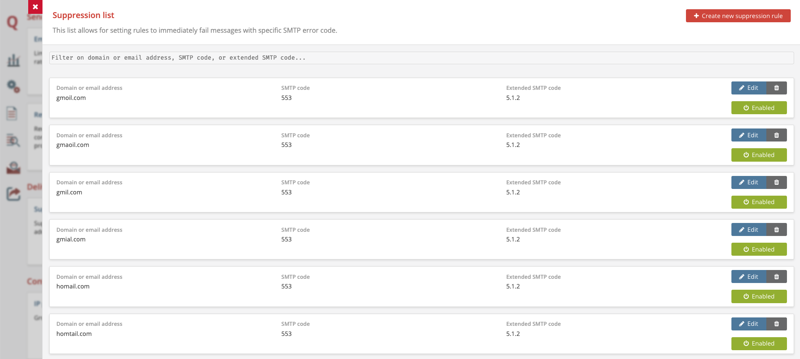

# Suppression List
## What is the Suppression List?
The Suppression List is a list of destinations to which the MTA should drop all traffic. These destinations can either be the receiving addresses or the receiving domain. This way, you can suppress delivery attempts to faulty domains with typical typos like "hotmai.com", "gmail.co", but also to email addresses you know do not exist (the ones for which you received a "mailbox does not exist" response) or other types of bad destinations. For each record on this list, you can specify an SMTP error code and description. You can update this list on-the-fly via the Management Console or through the REST API.

## Why would you use the Suppression List?
With MailerQ's Suppression List you can preemptively prevent unnecessary connections to bad destinations that have shown to be harmful for different reasons. Generally, we see four types of bad destinations:
1. Non-existing domain name
2. Non-existing mailbox
3. Non-human mailboxes
4. Bad destinations list

Consequently, sending to bad email addresses that end up on the list does not only hurt the reputation of that sender, but also potentially hurts the reputation of other clients that share the same IP addresses. With MailerQ's Suppression List, you can stop delivery attempts to these four types of bad destinations for all clients. Doing so can effectively and efficiently help protect your sender reputation and those of your clients. More on this subject can be found [here](https://www.mailerq.com/blog/four-types-of-bad-destinations-you-should-exclude-from-all-traffic)

## How to set up the Suppression List in MailerQ?
### Via the Management Console

- Make sure your MailerQ instance is running.
- Open the MailerQ Management Console.
- Click on the Setting menu page (left side menu bar) > 'Suppression List'. All records will be listed here for overview, editing and toggling. (Image 1) 
- In the top-right corner, click the “Create new suppression rule” button. Here, you can provide the destination you want to suppress, an SMTP code, optional extended SMTP code, and an error description.
- Press submit to store the new suppression rule and activate it immediately.

Image 1: Suppression List in the Management Console

### Via the REST API
Alternatively, you can add or remove records and get an overview of all records on the Suppression List using the REST API. The most up-do-date documentation can be found [here]( https://www.mailerq.com/documentation/5.9/rest-api-v1-suppressions)

For questions and suggestions on the specific use case of Suppression List, feel free to reach out to one of our experts via [info@mailerq.com](mailto:info@mailerq.com).