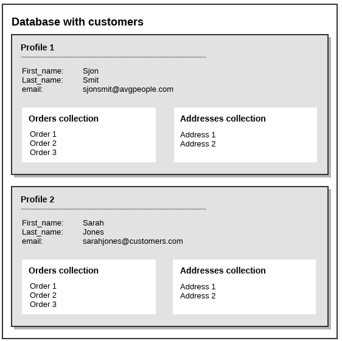

## Database collections

The Marketing Suite allows you to add extra layers of data to a basic database using collections. Collections come in handy when your campaigns demand more advanced data structures. 

*Real world example:* Movie database

Say, you have a website and newsletter about movies, and users of your website can write reviews about the the movies they've witnessed. Your database field structure could look something like this: 

Each database profile represents one website user, with fields for their name, email address, language et cetera. 
The database also has an interest group 'Genres' containing the interests 'Drama', 'Horror', 'Cult' et cetera, so users can pick the genres they're interested in. 
Finally, the database has a collection *UserReviews*, which will contain the reviews written by the user. The reviews collection could
contain fields for the ID of the movie, the rating, the review title, and of course the review itself.

Additionally, the database could have even more collections, for example to store a watch list at each user.

*And another real world example:*  

Say, you're sending newsletters to companies (B2B), and you have multiple contact persons at the same company. The ideal 
structure would then be a database with companies, with a collection containing the company employees as subprofiles. 
In a mailing you could target the company employees individually, because they all are stored inside a subprofile with their own details and email preferences. 

This way a company only has to be in the database once, without needing to have a complicated and diffused profile. By using collections, you are able to keep a clear overview in your database.

Some quick facts about collections

* A profile inside a collection is called a subprofile
* A collection can have a totally different field structure than the database in which it resides
* Just like with normal profiles and selections, you can segment data in collections using mini-selections.
* The same field types are supported inside collections, except for ... 
* ...interest fields (which are only available on database level.
* Mailings sent to a collection can be personalized with data from the database 
* In any database you can add as many collections as you need.
* There is no limit to the number of subprofiles added to a collection.

### Example 

The database in the image below shows two customers and their orders and addresses. 
The orders and addresses (shipping and billing) are stored in collections at the profile.  

