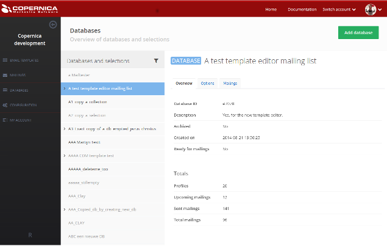

#MarketingSuite Database App

All data about about your relations is stored inside a database or multiple databases.
Databases are managed inside a seperate part of the MarketingSuite. 

A new account of the Marketing Suite is delivered almost empty and thus without any databases. To send a mailing or even a test email, 
you must first create a database wherein you store information about the destinations of your future mailings.

You can create and manage the databases of your account in the section [Databases](https://ms.copernica.com/#/databases)   

From here you will be able to create databases and/or view and edit your current databases, its structure and selections. Also, you can lookup the mailings that are sent and scheduled to a database and its selections. 

When creating a new database, it will have zero fields and no structure. You are free to structure your database any way you like. There is no limit on the number of database fields that you can add. 

