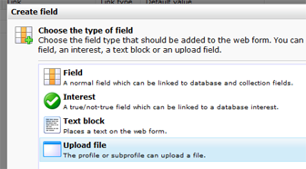
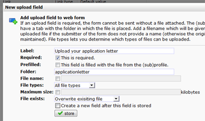

The web form upload field allows visitors of your website to upload a
file to their own profiles.

With upload files you could think of

-   an application letter
-   a profile picture (avatar)
-   a duck

To include an upload field in your web form, go to your web form. Click
'**add field**' and choose '**Upload field**'. This will bring you at
the settings for the upload field.

Files uploaded through the webform are automatically stored at the
profile that uploaded the file.

Also read: [Manage files uploaded to profiles in your
database](./manage-files-uploaded-to-profiles-in-your-database)\

### Edit the properties of the upload field

#### Label

Enter the text that is displayed next to the field. For example 'upload
file', 'add your picture' or 'your file or your life!'.

#### Required

Tick this box to make the upload mandatory.

#### Prefilled

If the user already has a file uploaded to his profile, the form will be
prefilled (only works when the profile is logged in when using the form)

#### Directory

Files must be filed under a directury in your database. Specify the name
of that directory with this field. You can find the files uploaded to
each individual profile at the tab '**File'** at the profile. ****.

-   **File name -** If you specify a file name, the uploaded file will
    be renamed accordingly. Otherwise it maintains its original name.
-   **Maximum size -** You can limit the size of the file users are
    allowed to upload
-   **File exists -**Should a file with the submitted name already exist
    under the person's profile, what should be the response of the
    form/database? Set up if it should overwrite the file, rename the
    new uploaded file (name\_1) or display an error to the submitter.

