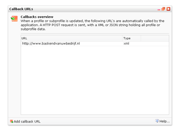
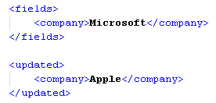

A callback URL is a web address that the application uses to send
information to another system, a CRM system for example. When a profile
or subprofile is created, modified or deleted in the marketing software,
the other system will automatically be informed of the change.

This functionality can be found at *Profiles \> Database Management \>
**Callback URLs***

*\
*A **HTTP POST** request will be sent to the callback URL. This request
contains a package with **XML** or **JSON** data on the changes in the
(sub)profile.

**

*example of XML data with old and updated information about a profile.*

**Note:** callback calls are invoiced according to the same rules as
SOAP API calls.

**Add a callback URL**
----------------------

-   Choose **Callback URLs** in the Database management menu
-   Click in the bottom toolbar on **Add CallbackURL**
-   **Enter the callback URL** and choose whether you want to send the
    data in XML or JSON format.

You may want to add multiple call back URLs. To do so, choose 'Add
callback URL' in the callback overview dialog.

**Callback conditions**
-----------------------

Create conditions if you only want to trigger a callback when the
profile or subprofile meet certain conditions. You can use both the
simple script editor and the JavaScript editor with which you can create
more advanced JavaScript conditions.

The callback is only triggered if the condition matches 'true'. In the
next example the callback will only be triggered if the value from field
company is equal to 'Apple'

`company == 'Apple'`
