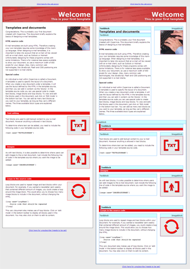
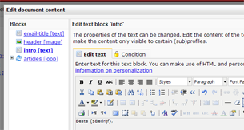

Once you have created a template, you can compose your first email
document. A document is always based on a template. If you
added [dynamic
blocks](./glossary/dynamic-content.en.md)
to your template HTML source, you can start adding content to your
document using those blocks.

### **Create a new document**

1.  Click on the template where the document should be based on
2.  From the document menu, choose ‘*New document*’
3.  Choose a name for the document and optionally a description
4.  Click on **store**

Super! You have now created a new email document. The document is still
empty. So why not start adding some content to it...

\*Image: the Copernica default template: the left is shown in preview
mode. The other is in Edit mode. You can edit the content of each block
by clicking on it. \*

### **Add content to the document**

To be able to add content to your email document, text, image and
loopblocks must be defined in the HTML template.

-   Click the document in the left overview to activate the document
-   To add content, click **edit mode** (in the lower toolbar below the
    email document).

All available dynamic blocks will now be highlighted and clickable.

-   Click a block to start adding content.

### **Adding textual content**

To add textual content you can use the Rich Text Editor or the HTML
editor.

Click the name of the block that you would like to fill. This will open
the *Rich text editor*. Type something, and then click **Store and
close** to see how it looks like in your email document.

[Learn more about adding textual content through text
blocks](./the-text-function-for-adding-textual-content-to-your-document.en.md)

### **Add images**

In the dialog window to edit the document content blocks, click the name
of the image block. If you have any images uploaded to your document's
‘files and images’ folder, you can choose any of these by clicking
‘Choose image’. To use an image from your computer, click ‘**Upload
image**’.

-   Open the tab **Settings** for additional options for the image.
-   Make the image a hyperlink in the tab *Hyperlink*.

[Learn more about adding images through images
blocks](./the-image-function-for-adding-images-to-your-document.en.md)

### **Looping content blocks**

If you have added loop blocks to your template, you choose how often it
should be iterated in the document. Click the name of the loop and then
enter the desired number of iterations.

Click **store** to save your changes.

In the left overview with blocks, you will now see each iteration with
its text and image blocks.

[Learn more about iterating content with loop
blocks](./the-loop-function-to-iterate-content-in-your-email.en.md)

**Previewing the document**
---------------------------

Click on **Preview mode** to switch to preview mode. Hover the button to
see the additional options.

To switch back to **Edit mode**, click the button again.

### **Enter the subject line, the sender name and address of the email**

Each email that you send must have a *subject line*, a *sender name* and
a *sender address*

You can enter the subject and sender information directly above the
document. Click, type, and then hit enter.

Click **Add header** to use additional headers, such as the Bcc or
Reply-to headers.

[Read more about email
headers](./sender-subject-and-other-email-headers.en.md)

**Testing the email document**
------------------------------

Now that you have created your first email document, you probably want
to see how it looks like in your inbox.

In the menu **Mailings**, click ‘Send test mailing’. This will open a
dialog from where you can send a test email to your [test
destination](./what-is-the-test-destination.en.md)

[Read more about sending test
mails](./send-a-test-mail-or-test-mailing.en.md)
