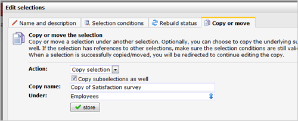

It may happen that you accidentily create a selection on the wrong
place. Fortunately, you can easily move a selection to a different
location. Selections can also be copied. This is useful when you want to
create multiple selections that differ slightly from each other.

You can copy and move selections from the tab *Copy or move selections*
at the *Edit selections* dialog (Database management \> **Edit
selections**)

Copying or moving (mini)selections has no effect on the actual content
of the database, no profiles or subprofiles can be harmed.

Copy selection
--------------

With this function, you make an exact copy of the selection. After
you've made the copy, you can directly start editing the copy. This does
not affect the original.

-   Optionally, you can choose to also copy the
    [subselections](./creating-subselections.en.md)
    under the original.
-   The name of the copy must be unique.
-   The selection can be copied to any location within the same
    database.

Move selection
--------------

A selection can be moved to a different location.

-   Choose the new location for the selection.
-   Note that if the selection has subselections, all subselections will
    be moved along.
-   The selection can be moved to any location

### Mini selections

Because mini selections can be created on just one level (there is no
such thing as a subminiselection), mini selections can only be copied
(not moved). It is not possible to move or copy a mini selection to a
different collection.

### Selections with references

If the selection that you copy or move contains references to other
selections, make sure that its references still work at the new
location.
