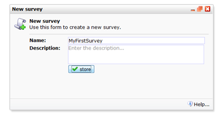
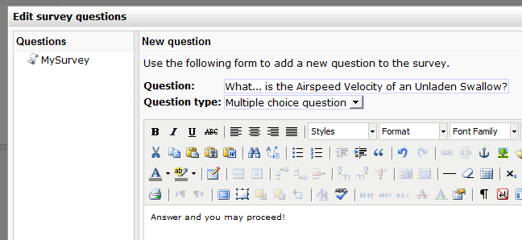

Surveys are a very powerful tool to learn how contacts think of your
company, your service, products or whatever you like to know about them.

Surveys are easily created and can be published on your website in a
wink. If you [link to this website from an
emailing](http://www.copernica.com/en/support/linking-to-your-website-from-an-emailing),
individual answers given are even automatically linked to the profile.

To add a new survey to the application, use the function labelled so
under the **Survey menu**of **Content**.

Choose a descriptive name and an optional description. Once your survey
is created, you can start adding questions.

### Adding questions to the survey

1.  In the survey menu, find the **New question**option.
2.  You can immediately start creating the first question. Enter the
    name of the question, and [choose the type of the
    question](http://www.copernica.com/en/support/survey-question-types-and-their-options).
    The text editor allows you to place 'underwriting' to your question,
    such as 'please check only one box'.

*Image: a new question is added: What... is the Airspeed Velocity of an
Unladen Swallow?*

1.  Click on store to save the question and proceed to the next step.

After saving a question you will be presented with at least two extra
options:

-   **Optional *-***check this box if the question may be skipped by the
    participant. Otherwise he/she will be obliged to fill in an answer
    before his/her survey can be submitted.
-   **Starts on new page** - check this box if this question should
    start on a new web page. There will be a submit button added after
    the last question before this one, and those questions will not be
    shown again on the next page where this question starts.
-   **Display** - Choose checkboxes if multiple answers are allowed for
    this question. Choose select box to allow only one answer.

### Survey question types

You can use different types of questions within your survey. [Learn more
about those survey question types
here](http://www.copernica.com/en/support/survey-question-types-and-their-options).
