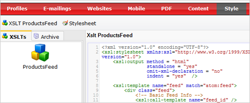
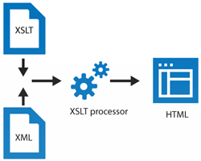

Designers that work with CSS and XSLT get very happy when they work with
Copernica. You see, all publications you create with our software can be
fully restyled and restructured. We find this part so important, we
created a whole section for it in Copernica.

The **Style** component in Copernica is fully equipped for creating and
managing your own style sheets and XSLT files.

Table of contents
-----------------

### CSS stylesheets

-   [What can i do with CSS](#1)
-   [Create and manage new and existing stylesheets](#2)
-   [Easily test your stylesheet on a webform, survey or web feed](#3)
-   [Link your stylesheet to a template, document or web page](#4)
-   [Using CSS in your emailings](#5)

### XSLT in Copernica

-   [What is XSLT](#6)
-   [How does XSLT work](#7)
-   [Create your own XSLT](#7-1)
-   [XSLT resources](#8)
-   [Link your XSLT to a webform, feed or survey](#9)

Using stylesheets in Copernica
------------------------------

### What can I do with CSS

With CSS you set up rules to define different displaying of HTML
elements. Using CSS you can for example state that all paragraphs should
have a letter size of 13 pixels.

Webforms, surveys and feeds come with a standard style sheet that you
can edit as much as you like. They're equipped with /\* clear commentary
\*/, so that you can get started right away.

#### Use a CSS stylesheet to

-   Change the colour and font size of each paragraph
-   Give every image used in a document a red border
-   Centrally align all headers
-   Change the bullet type of an unordered list
-   Give a web form text field those neat rounded borders
-   Et cetera.

The software uses a default CSS file to display web forms, surveys and
content feeds created within the software. You are of course free to
edit these style sheets to manipulate the appearance of your web form,
feed or survey.

### Create and manage your own stylesheets

Web forms, feeds, surveys always have a default style sheet. If you wish
to modify their rules, or create your own style sheet, you can do so
under **Style**. The default style sheets come with lots of comments
that will help you modifying it. Note that a stylesheet is not linked to
a web form, but to the web page or template whereon you have published
it. You can [link a style
sheet](https://www.copernica.com/en/support/email-templates-and-css-stylesheets) to
the page, document or template through its context menu. The same
applies to stylesheets for surveys and feeds.

Further reading: [Manage CSS stylesheet
files](http://www.copernica.com/en/support/manage-css-stylesheet-files)

### Link your stylesheet to a template, document or web page

To use a stylesheet with your document or template, find the
option **Set style...** in the template or document menu. Once you have
linked a style sheet, an additional tab **Style** is added above the
document or template. From here you can instantly edit its rules. Note
that the changes apply to all publications that use this style sheet.

### Using CSS in your emailings

Because some important email clients can't (or just refuse to) handle
CSS styling very well, Copernica converts certain elements to inline CSS
when your email is sent, so that your email still looks like it's
supposed in clients like Gmail.

When setting the style for your document, you are presented with a few
options

-   Choose to maintain the style blocks to leave the style blocks in the
    header or external style sheet in tact. No conversion to inline
    attributes will take place.
-   Choose *'replace style blocks to style= attributes*' to make the
    document or template suitable for email clients.
-   Choose the third option to keep the block styles, and also convert
    them to inline attributes.

Once you have linked the stylesheet to the document or template, an exta
tab [style] will show up above the document. From here you can quickly
edit its content.

XSLT in Copernica
-----------------

### What is XSLT

Web forms, surveys and content feeds are built upon XML. The XML file
contains the data, and describes what kind of data it is. The XSLT
(Extensible Stylesheet Language Transformations) is then used to
transform the data from the XML to the mark-up language readable for the
internet browser: HTML. So, what can you do with XSLT?

-   All titles should be placed within HTML  header tags \<h1\>
-   A paragraph should be placed within HTML paragraph tags
-   Give an image a CSS class
-   The publish date of an article should not appear in the HTML
    document. The author of the article must appear below the article.
-   [Remove the
    \#-sign ](https://www.copernica.com/en/support/working-with-css-and-xslt-a-brief-introduction#)that
    is placed before each survey question.
-   Et cetera….

### XSLT in practice

As mentioned earlier, a web form starts with plain information in XML
format. The XML code below represents a web form, and contains
information about its fields, label texts and the unique ID of the web
form.

    <webform>    <id>42</id>   <buttontext>Send</buttontext>   <field>     <id>2b3616f2a90c96c8193b932bded51985</id>     <label>Voornaam</label>     <required>yes</required>      <type>text</type>     <value/>    </field>  </webform>  

Very interesting, all that plain information, but unless it's converted
to HTML, it is useless to an internet browser. And that's where XSLT
comes in.

In the XSLT file you define how the plain XML should be given to the
browser. The XSLT code below puts the label from the XML in a *div* with
a CSS class. Whenever the field is required, an asterisk is placed
behind the field.

    <!-- Add a label in front of the input field -->  
     <xsl:value-of select="label" />     
:
     <xsl:if test="required = 'yes'">
*
</xsl:if>  

                    

### Create your own XSLT

The software adds a default XSLT to all content feeds, surveys and web
forms. Therefore making your own XSLT is not required to publish content
with the application. But you are of course free to do so, or to adjust
the default XSLT to fit your own needs.

Creating a new XSLT file is fairly simple.

-   Go to the Style component. All functions related to creating and
    managing XSLT files are found in the XSLT menu in the top-left
    corner.
-   Choose where you want to create the XSLT file for (Web forms,
    surveys
-   When creating a new XSLT, you can choose to 'Fill the new XSLT with
    default code'.

### XSLT resources

As opposed to CSS, XSLT programming is quite complex, and requires
specific knowledge. Much can be found on the internet about XSLT's,
since it is a standard technology. For example
[http://www.w3schools.com/xsl/](http://www.w3schools.com/xsl/) provides
a comprehensive starters guide.

### Link your XSLT to a webform, feed or survey

Once you have created your own XSLT it can easily be linked to the
publication where you have created the XSLT for. This is done by adding
the *xslt=* parameter to the tag to publish the webform, survey or web
feed.

> `{feed name=my_feed xslt=myxslt}                     {survey name=my_survey xslt=myxslt}                     {webform name=my_webform xslt=myxslt}`
