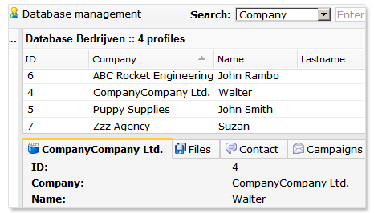

A database is build up with fields. Fields define which type of data can
be stored in your database. For example you can create fields for
'name', 'e-mail adress', 'interest' and 'birthdate'.

You can add and edit fields in *Profiles \> Database management
\> **Edit database fields***

When creating your database fields, consider all the options you will
need for your e-mailings and the data you wish to store. For example
don't create a field *name*if you wish to adress contacts with only
their family name in e-mailings. In that case create the fields *first
name*, *family name*and *title*.

You may add as much fields to a database or collections as needed. 

**Note:** This article is covers both database and collection fields
unless stated otherwise.

Types of fields
---------------

### Numeric field

Numeric fields can only contain numbers [0-9]. Use this field type to
store information such as age or weight. Numeric fields must always
contain at least one number (an empty field cannot be stored). Tip: make
a 0 (zero) the default field value.

*(SOAP API users: use the field type 'float' to store numbers with
fractions)*

### Text field

Text fields, as the name suggests, are fields used for textual content.
Text fields can contain all sorts characters including text, numbers,
and special characters.

Text fields can have up to 5 rows (multiline). The default length of a
text field is 50 characters. You can enhance this number up to 255. If
you want to use more than 255 characters rather use a ‘big field’ (see
below).

Note: the number of rows is only used in the *Edit Profiles dialog* and
in the profile overview. It doesn’t affect web forms.

### Big fields

Big fields are basically the same as text fields, there's just one
little difference: it can contain up to 16 million characters (enough to
store a best seller).

Note. Big field is only field type that cannot be indexed.

### Date field

Date fields are (obviously) used to store dates. Date fields must
contain a valid formatted date in the system format (yyyy-mm-dd). Fields
with no date specified are automatically filled with zero’s (0000-00-00)
if you have checked the option '*may not be empty*'.

Example: 1980-09-20 (20 September 1980)

### Datetime field

Datetime field are normal date fields but extended with 24h time
notation (hh:mm).

Example: 1980-09-20 08:56

### Email fields

**E-mail fields** may only contain legitimate e-mail addresses.

This field is used by the application for sending bulk mailings, test
mailings and so forth.

When editing profiles, the entered value will be validated if it
contains a well formatted e-mail address. If not, a warning will be
given. This warning can be ignored if desired.  E-mail addresses are
 validated if they really exists, by sending a dummy e-mail to the
address. This dummy e-mail of course never reaches the recipients actual
inbox). You will be notified when the dummy-test has failed and the
address probably doesn’t exist.

Note that a database or a collection can only contain one e-mail field
at a time.  

### Phone field

A **Phone field** can be configured for fax, mobile and ‘other’.

If you use Copernica to send fax mailings, the number in
thedatabase phone field ‘fax’ will be used. The field GSM is used for
mobile campaigns. You can check ‘other’ for remaining telephone numbers.
As with email address fields, a database can only contain one field for
mobile numbers and one field for fax numbers. Creating a second mobile
or fax fields will change the original field to a text field.

### Multiple choice field

A**multiple choice field** is depicted as a dropdown selection box when
editing profiles. When editing the profile, only the pre-entered values
are available. Configure the choices in the 'value' field. The first
answer becomes the default value for new profiles. If a different value
should be default, you can use an asterisk (\*) in the database field
settings to mark it. In the next example, the city Hamburg is the
default value:

> Berlin
>  Bonn
>  Hamburg
>  Frankfurt\*

Note, a multiple choice field is not automatically depicted as a drop
down box if it’s being used in web forms. This can be set independently
in the web forms Add/Edit field dialog.

If desired you can leave one multiple choice option value blank.

### Interest fields

An** interest field** is a special kind of field that allows only two
values: checked or unchecked. It is used mainly for listing interests
and preferences of contacts, hence the name. For example
an interest field could be 'newsletter' - yes/no.

Note: Interest fields are only available for databases (not
collections!)

### Reference field

Reference fields are used to make references to other databases
(multidimensional databases). More info on working with multidimensional
databases will follow shortly.

### Country code field

This field only accepts country codes according to the ISO 3166
standard. The country code for the Netherlands is and GB for the United
Kingdom. For a complete list of country codes, you can visit the website
of ISO.org.

[List with country codes accepted in the country code
field](http://www.iso.org/iso/country_codes/iso_3166_code_lists/country_names_and_code_elements.htm)

Additional options
------------------

The edit fields dialog comes with some additional options.

### This field is a hidden field that will not show when editing profiles

The field is not shown when editing a profile or subprofile. \
Use this option for passwords fields or fields which should only be
editable by profiles themselves (via web forms).

**Note:** this option doesn’t affect how the field is displayed in web
forms. This is set separately at the web form under Content.

**Note 2:** As with normal fields, a hidden field can be included when
importing and exporting data.

### Show this field on overview pages

Check this option to make this field visible in theprofile overview
pages.

### This field is ordered by default

The field will be used for ordering the profiles alphanumeric. This
option can only apply to one field at the same time. The value of this
field is shown in the database tab in the profileoverview page. See
image below.

*The field ‘Company’ is ordered.*

-   The name of the Company is now shown in the profile tab.
-   The profiles are ordered alphanumeric with the company name in
    the profile grid.

### This field is indexed

Use this option for fields you frequently use for searching profiles.
Indexing these fields speed up the searching with these fields and the
(re)building of selections based on these fields. You can index up to 64
fields. Fields from the type *Big field *cannot be indexed.
