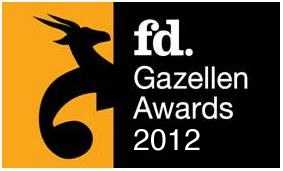

Copernica wurde dieses Jahr mit dem FD Gazelle Award ausgezeichnet, der
Copernica ebenfalls 2011 und 2010 verliehen wurde. Mit dieser
Errungenschaft gehört Copernica zu den am schnellsten wachsenden
Organisationen in den Niederlanden.

"Wir sind stolz auf diese Anerkennung und auf unser kontinuierliches
Wachstum in den Niederlanden und auf internationaler Ebene." so Michael
Linthorst, Managing Partner von Copernica. “Unser Fokus liegt auf der
Entwicklung der leistungsstärksten Marketing-Software auf dem Markt,
indem wir unseren Nutzern eine Lösung anbieten können, die Ihnen zu
Ihrem eigenen Marketingerfolg verhilft."  

Copernica hat kürzlich den Hauptsitz nach Amsterdam verlegt, um das
internationale Wachstum zu fördern. "Copernica und Amsterdam passen
perfekt zusammen. Dort sind wir in direkter Nähe zu der dynamischen
IT-Community und den Universitäten mit den vielen technischen Talenten."

**Über FD Gazellen Awards:**

Die FD Gazellen Awards werden nur an die am schnellsten wachsenden
Organisationen in den Niederlanden verliehen. Um für den FD Gazelle
Award nominiert zu werden, muss das Unternehmen ein Minimum von 20%
Umsatzwachstum über einen Zeitraum von drei Jahren realisieren. Am 29.
November wird der FD Gazellen Award den am schnellsten wachsenden
Unternehmen in Nord-Holland und Utrecht verliehen.

 
