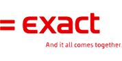

Diese Folge dürfen Sie nicht
verpassen, wenn Sie: \
\
 - Interesse haben herauszufinden wie Sie lead-Scoring in Ihrem
Unternehmen implentieren können; \
 - mehr erfahren wollen über das Warum von Marketing Automation, aber
noch nicht wissen wie; \
 - Best-Practices in Ihrem Unternehmen implementieren können. \
 \
 Achtung: Diese Folge von CopernicaTV ist auf Englisch\
\

[Sofort
anmelden](mailto:communication@copernica.com?subject=CopernicaTV%20Registrierung%20|%20Exact%20Software%20|%2010.%20Dezember)

\
\

Nehmen Sie Teil an dieser spannenden LIVE Episode von Copernica TV mit
dem internationalen Software-Hersteller, Exact Software. Schicken Sie
eine E-Mail an
[communication@copernica.com](mailto:communication@copernica.com?Subject=Register%20for%20Exact%20webinar&Body=I%20'd%20like%20to%20sign-up%20for%20the%20webinar%20on%20December%2010th%20at%203:30gmt%20(16:30%20CET))
und wir registrieren Sie. Plätze sind begrenzt, also seien Sie schnell
dabei!

)

Exact hat einen Traum zu verbinden. Anderen miteinander und Sie zu Ihrem
Geschäft. Darum stellt Exact Software her, die verbindet.

Anfang 2013 implementierte die Exact Business Solutions eine Marketing
Automation Strategie. Der entscheidende Faktor dieser Strategie war ein
Lead-Scoring Modell, welches direkte Erfolge gebucht hat: \
- Niedrige Implementierungskosten verglichen mit dem ROI\
 - Durchschnittliche Öffnungs-Raten von über 40%\
- 40% der Marketing Qualifizierte Leads wurden zu Sales Qualifizierte
Leads transformiert\
- Die Durchführung der Strategie in mehreren Ländern

**Über Exact**

Seit 1984
unterstützt Exact Unternehmen mit Informationstechnologie. Dabei
entwickelte sich Exact von einem studentischen Start-Up-Unternehmen zu
einem globalen Anbieter von Software-Lösungen und Services für CRM, ERP,
Lohnabrechnung und Buchhaltung. Wegen dieser breiten Palette an Lösungen
von professioneller Unternehmens-Software, steht auf der Webseite viel
spezieller Content. Dabei gilt es auch die richtige Nachricht am
richtigen Zeitpunkt zu steuern.
