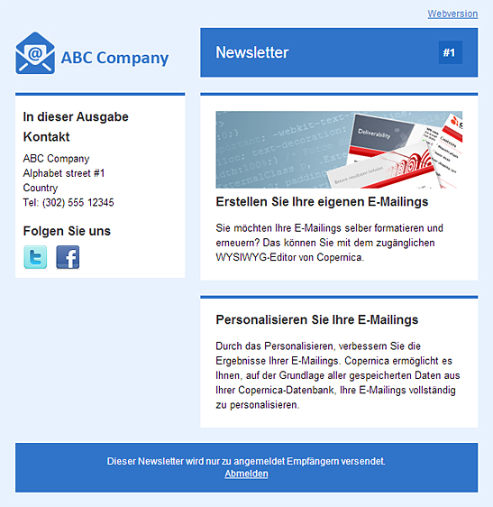
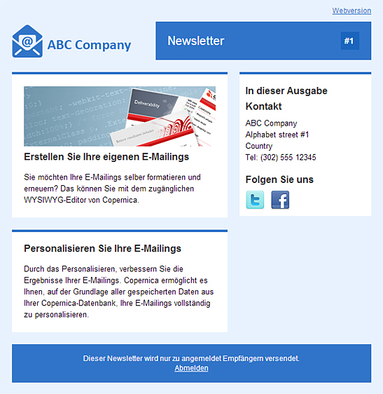

Die Vorlagen sind kostenlos nutzbar und wurden in den meisten gängigen
E-Mail-Clients wie z. B. Outlook 2003, 2007, 2010, Gmail, Hotmail oder
Apple Mail getestet. Weiterhin können die Templates für die Erstellung
Ihrer eigenen E-Mail-Kampagnen innerhalb Copernica heruntergeladen und
benutzt werden.

**Zweispaltiges Layout mit einer Sidebar links**
------------------------------------------------

Download
--------

****Entwickelt von**:** Copernica BV\
**Layout:** Zweispaltig\
\
[Download](../downloads/two-col-left-sidebar-blue-de.zip "Download")

* * * * *

**Zweispaltiges Layout mit einer Sidebar rechts **
--------------------------------------------------

Download
--------

**Entwickelt von:** Copernica BV\
**Layout:** Zweispaltig\
\
[Download](../downloads/two-col-right-sidebar-blue-de.zip "Download")
