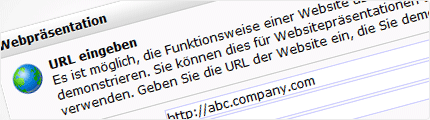

Sie haben eine Kommunikations-, Internet- oder Marketing-Agentur und
möchten gerne Ihr Dienstleistungspaket mit der stärksten
Marketing-Software ergänzen? Mit der Copernica Partner-Lizenz bieten wir
Ihnen eine Lösung, mit der sie selbständig E-Mail-, Web-, SMS-, Social-
und PDF-Kampagnen erstellen. \
\
 Als Partner von Copernica sind Sie Teil des Copernica
Partner-Programms. Wenn Sie sich für die Zusammenarbeit mit Copernica
entscheiden, dann werden Sie in unser weltweites Partner-Netzwerk
aufgenommen. Durch die Software, die Webseite und die Veranstaltungen
von Copernica, treten Sie mit Copernica-Nutzern und Interessenten in
Kontakt. Über das Partner-Programm helfen wir Ihnen gerne neue Kunden zu
finden.

-   [Finden Sie einen Partner](http://www.copernica.com/de/support/finden-sie-einen-partner "Finden Sie ein Partner")
    -----------------------------------------------------------------------------------------------------------------

    

    Als registrierter Copernica Partner erhalten Sie eine individuelle
    Seite auf copernica.com, wo Sie Ihr Unternehmen an Copernica Nutzern
    und Prospects profilieren können.

    [Übersicht der registrierten Copernica
    Partner](http://www.copernica.com/de/support/finden-sie-einen-partner "Finden Sie ein Partner")

-   [Entdecken Sie unser Partner-Programm](./register-as-copernica-partner.md "Entdecken Sie unser Partner-Programm")
    --------------------------------------------------------------------------------------------------------------------------------------------------------

    

    Entdecken Sie die verschiedenen Vorteile des Partnerprogramms von
    Copernica. Lesen Sie mehr über das Geschäftsmodell für Partner und
    wie Sie mit Neukunden in Kontakt kommen.

    [Lesen Sie mehr](./register-as-copernica-partner.md "Entdecken Sie unser Partner-Programm")

-   [Partner-Unterstützung](http://www.copernica.com/de/partners/partner-unterstutzung "Partner-Unterstützung")
    -----------------------------------------------------------------------------------------------------------

    

    Als Partner von Copernica stehen Ihnen verschiedene Mittel zur
    Verfügung, um den Verkauf der Copernica Marketing Software
    anzutreiben und schneller mit neuen Kunden in Kontakt zu treten.

    [Lesen Sie
    mehr](http://www.copernica.com/de/partners/partner-unterstutzung "Partner-Unterstützung")

-   [Warum eine Partner-Lizenz?](http://www.copernica.com/de/partner/5-wege-zur-umsatzsteigerung "Warum eine Partner-Lizenz?")
    --------------------------------------------------------------------------------------------------------------------------

    

    Eine Partner-Lizenz bringt für einen Partner mehrere Vorteile mit
    sich. Entdecken Sie Ihre Möglichkeiten und den Inhalt der Copernica
    Partner-Lizenz.

    [Lesen Sie
    mehr](http://www.copernica.com/de/partner/5-wege-zur-umsatzsteigerung "Warum eine Partner-Lizenz?")

-   [Antrag Partner-Preise](http://www.copernica.com/de/partners/anfragen-partner-preise "Antrag Partner-Preise")
    -------------------------------------------------------------------------------------------------------------

    

    Möchten Sie Copernica gerne zu Ihren Diensten hinzufügen? Fragen Sie
    die Partner-Preise von Copernica mit dem beigefügten Formular an.

    [Fragen Sie Partner-Preise
    an](http://www.copernica.com/de/partners/anfragen-partner-preise "Antrag Partner-Preise")

