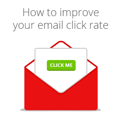
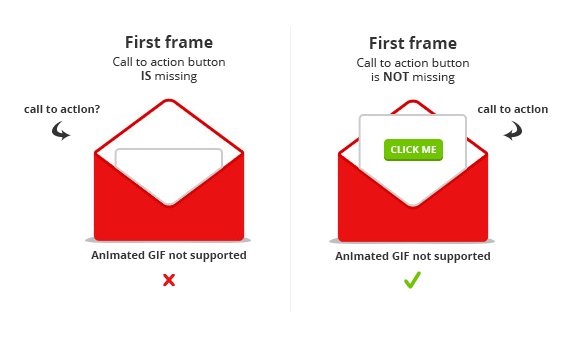
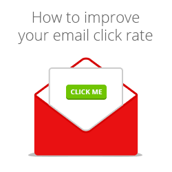

Haben Sie jemals in einer HTML-E-Mail ein animiertes GIF verwendet und
danach erst herausgefunden, dass es in einigen E-Mail-Clients nicht
funktioniert? Die folgenden Punkte sollten Sie beachten, wenn Sie in
HTML-E-Mails animierte GIFs einsetzen:

Der erste Frame ist entscheidend
--------------------------------

Einige E-Mail-Clients zeigen nur den ersten Frame eines animierten GIFs
an. Nehmen wir zum Beispiel die folgende animierte Grafik: Wie Sie sehen
können, erscheint der Call-to-Action am Ende der Animation.

Im folgenden Beispiel können Sie sehen, wie dieses animierte GIF in
einem E-Mail-Client angezeigt wird, der keine animierten Grafiken
unterstützt.

Wo ist der Call-to-Action-Button? Nicht im ersten Frame. Dieses Beispiel
zeigt, warum Sie dem ersten Frame einer Animation besondere Bedeutung
beimessen sollten. Nehmen Sie den wichtigsten Teil Ihrer Nachricht – und
dazu gehört in der Regel ein Call-to-Action-Element – in den ersten
Frame auf, damit er keinem Ihrer Abonnenten vorenthalten bleibt.

In den meisten Fällen wird es sinnvoll sein, den letzten Frame einer
Animation nochmals als ersten Frame aufzunehmen. Wenn möglich, setzen
Sie die Verzögerungszeit (Delay) für den ersten Frame auf Null, damit er
in E-Mail-Clients, die animierte GIFs unterstützen, einfach nicht
angezeigt wird.

Welche E-Mail-Clients unterstützen animierte GIFs?
--------------------------------------------------

Zum Glück werden animierte GIFs in den meisten weit verbreiteten
E-Mail-Clients durchaus unterstützt. Aber es gibt einige Clients, auf
die Sie aufpassen müssen. Wir haben die wichtigsten Clients in dieser
Liste für Sie zusammengestellt:

**Mobile Clients**

-   iOS (Ja)
-   Windows Mobile 8 (Ja)
-   Android Default (Nein)
-   Android Gmail (Nein)

**Web Clients**

-   Gmail (Ja)
-   Outlokk/Hotmail (Ja)
-   Yahoo! (Ja)
-   AOL (Ja)

**Desktop Clients**

-   Apple Mail (Ja)
-   Thunderbird, aktuelle Version (Ja)
-   Outlook 2003 / Express (Ja)
-   Outlook 2007+ (Nein)

Extra-Tipps: Reduzieren der Dateigröße
--------------------------------------

Je kleiner eine Datei, desto schneller wird sie geladen – richtig? Die
folgenden Tipps sollen Ihnen dabei helfen, möglichst kurze Ladezeiten zu
erreichen.

**Die Anzahl der Frames auf ein Minimum reduzieren**\
 Meiner Meinung nach die wichtigste Regel: Reduzieren Sie die Anzahl der
Frames auf ein Minimum. Übertreiben Sie es nicht mit der Animation. Denn
mehr Frames bringen automatisch eine umfangreichere Dateigröße mit sich.
Ich habe zum Vergleich drei identische animierte GIFs erstellt (siehe
unten). Der einzige Unterschied ist die Anzahl der verwendeten Frames.
Wenn Sie die Animation schlicht gestalten und so wenige Frames wie
möglich nutzen, können Sie die Dateigröße klein halten.

Animierte GIFs

**1**
Anzahl der Frames: 5
Dateigröße: 7.08kb
Farben:64

**2**
Anzahl der Frames: 6
Dateigröße: 7.28kb
Farben:64

**3**
Anzahl der Frames: 7
Dateigröße: 7.41kb
Farben:64

**Farbtiefe einstellen**
Eine andere Möglichkeit, ein animiertes GIF klein zu halten, ist es,
die Farbtiefe zu reduzieren. Dafür müssen Sie lediglich einen guten
Kompromiss zwischen Qualität und Dateigröße finden.

**Speichern ohne Metadaten**
Photoshop speichert standardmäßig Metadaten mit, wenn man eine Datei
für die Webnutzung abspeichert. Dazu gehören zum Beispiel Copyright,
Kontaktinformationen und Informationen zur verwendeten Kamera. Wenn Sie
diese Option abschalten, können Sie die Größe Ihrer GIF-Datei weiter
reduzieren.

### Das war's schon.

Wie erstellen Sie Ihre animierten GIFs? Verraten Sie es mir in den
Kommentaren - ich bin gespannt! Viel Spaß beim Animieren!
