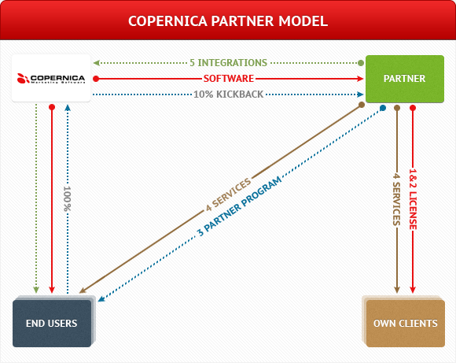
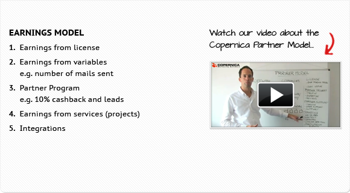

Holen Sie durch die Registrierung als Copernica Partner das meiste aus
Ihrer Partnerlizenz.

Vorteile
--------

Mit diesem Programm sichern Sie sich diese Vorteile:

-   Erweitern Sie Ihr Produktportfolio mit der Copernica Marketing
    Software
-   Empfangen Sie attraktive 10 % Kommission
-   Kommunizieren Sie Kompetenzen an über 3.500 Copernica-Nutzer

Wie funktioniert das Partner-Programm?
--------------------------------------

Als Partner von Copernica, erstellen Sie zunächst Ihr eigenes
Partnerprofil. Über Ihr Profil können sich Benutzer unter anderem Ihre
Kompetenzen, Preise und Bewertungen anderer Benutzer auf copernica.com
und in der Software anschauen.

Ein Benutzer wählt beim Erhalt seiner Copernica-Lizenz oder sobald er
auf der Suche nach spezifischer Unterstützung ist, einen geeigneten
Partner aus dem Partner-Programm aus. Als ausgewählter Partner sind Sie
der erste Ansprechpartner des Benutzers für all seine Fragen.

Präsentation über das Partner-Programm
--------------------------------------

Mit dem Partner-Programm haben Sie verschiedene Möglichkeiten, um sich
als Partner von Copernica zu präsentieren. Sie können sowohl andere
Benutzer als auch Interessenten von Copernica kontaktieren.

-   Ihr Partnerprofil wird in der Partnerübersicht auf unserer Webseite
    und in der Software aufgenommen. Hier können Sie u.a. Ihre
    Kompetenzen und Ihr Projekt-Portfolio dokumentieren.
-   Präsentieren Sie Ihre Copernica-Kenntnisse und eigene
    Dienstleistungen auf der Messe. Sie erhalten als Partner einen
    eigenen Platz beim Copernica-Stand, wo Sie Ihren Interessenten die
    Software demonstrieren und sie von Ihren Diensten überzeugen können.
    Hier finden Sie die [Veranstaltungen](./events.md "Veranstaltungen von Copernica"),
    bei denen Copernica anwesend ist.
-   Publizieren Sie gemeinsam mit Copernica Artikel, Fallstudien,
    Pressemitteilungen und teilen Sie Ihre Erfahrungen auf unserer
    Webseite, Blogs und natürlich Ihrer eigenen Webseite mit. Mit
    Copernica können Sie durch
    [Linkbuilding](./media-resources.md "Linkbuilding") online
    besser gefunden werden.

Das Geschäftsmodell für Partner
-------------------------------

Mit Hilfe Ihrer Partner-Lizenz und dem Partner-Programm gibt es mehrere
Möglichkeiten, mit denen Sie als Partner durch Copernica verdienen
können.

### Direkt verdienen über Ihr eigenes Netz:

-   Als Partner setzen Sie Copernica für sich selbst und Ihre eigenen
    Kunden ein und können frei bestimmen, was Sie Ihren Kunden für die
    Softwarenutzung berechnen. Benutzen Sie die Software als Whitelabel.
    Fügen Sie Ihr eigenes Markenzeichen hinzu und bieten Sie Copernica
    als eigenen Dienst innerhalb Ihres Netzes an.
-   Verdienen Sie zusätzlich durch den Verkauf Ihrer eigenen
    Dienstleistungen und Copernica als Zusatzleistung, an Ihrem eigenen
    Kundenkreis.

### Indirekt verdienen über das Copernica Partnerprogramm:

-   Sobald ein Benutzer Sie als Support-Partner für Copernica gewählt
    hat, erhalten Sie 10% Umsatz vom Gesamtumsatz von Copernica für
    diesen Benutzer. Dabei sind Sie der erste Ansprechpartner für Fragen
    über Copernica und sind selbst verantwortlich für die
    Kundenzufriedenheit.
-   Mit dem Copernica Partner-Programm können Sie Ihre eigene Arbeit und
    Dienstleistungen anbieten. Bieten Sie konkurrenzfähige Preise an und
    verwalten Sie Ihr Partnerprofil, um mehr Copernica-Nutzer von Ihrem
    Mehrwert zu überzeugen.
-   Copernica ermutigt seine Partner,
    [Integrationen](./integrations.md "Integrationen")
    in Kombination mit Copernica zu entwickeln. Diese werden jetzigen
    und potenziellen Benutzern unter anderem auf copernica.com angeboten
    und genießen die erforderliche Medien-Aufmerksamkeit von Copernica.

