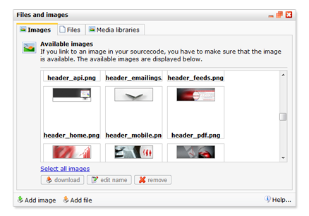
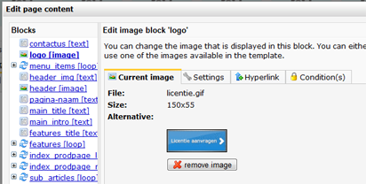

Most HTML emails contain images as well. Images and files can be stored
in the Files and Images folder (belonging to the template or document)
or in a Media Library. It is also possible to use images hosted on a
server elsewhere.

-   Files and images uploaded to the **template** are available in the
    template and in all underlying documents
-   Files and images uploaded to the **document** are only available in
    the document
-   Files and images uploaded to a **media library** can be used in all
    publications (templates, documents, webforms, surveys, feeds)

The files and images folder. Files and images stored in this folder or
in the linked media library can be used in the document, template,
survey et cetera.

### Using images in template source code

From the template HTML source code you can refer to an image as follows:

### **Image stored in Images folder or in linked media library**

``

### **Image stored on a server elsewhere**

``

### From an image block

If your template uses images blocks (most template do) you can add an
image to the document as follows:

1.  Go to **document edit mode**
2.  Click on an image block.
3.  Click on **Choose image**to select an image already uploaded to the
    document or template images folder
4.  Choose **upload image** to upload an image from your computer.
5.  The tabs **Settings, Hyperlink** and **Conditions**allow you to
    configure additional options for the image.

### Add image to a text block, using the *Rich Text Editor*.

The rich editor allows you to use images inside a text block.

To add an image, click on the **image icon**  in the editor toolbar. A new window will pop
up, allowing you to add an image and edit its properties. To use this
function, make sure to disable your browser pop-up blocker first.

 
