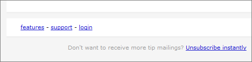

If your email has no working and clearly visible unsubscribe link,
people who wish to unsubscribe are tend to mark the email as
spam. Copernica offers various methods to facilitate and process
unsubscribes.

The most common way to establish this is through an unsubscribe link.
**This is a hyperlink which will unsubscribe the reader when he clicks
on it**. After that, you are no longer allowed to send an e-mail to that
address.

-   Do not hide your unsubscribe link! Place it somewhere in your
    document where it cannot be overlooked.
-   Test your unsubscribe link thoroughly!
-   Don’t make the unsubscribe process complicated with things like
    confirmation emails. If you are making the unsubscribe action too
    complex, people are tend to just go for the spam button instead.
-   The more people mark you as spam, the lower your sender reputation
    gets.

Adding the unsubscribe link
---------------------------

The application offers three ways to process unsubscribes automatically
in your contact database.

### Method 1. The {unsubscribe} link and the unsubscribe header

Users can unsubscribe themselves by clicking on
the [{unsubscribe}](./the-unsubscribe-function.m) link.
The unsubscribe behaviour configured on the database or collection will
then be performed. The unsubscribe request is also triggered when a
subscriber marks your email as spam or when the software receives an
email on the abuse address in response to your email.

#### Checklist, three important things to take care of when choosing this method:

-   The [{unsubscribe}](./the-unsubscribe-function.md "unsubscribe function")
    link is added to your email template.
-   The full unsubscribe header is activated.  
-   You have configured the [unsubscribe
    behaviour](./setting-unsubscribe-behaviour-for-your-database-or-collection.md "unsubscribe behaviour")
    on the target database or collection. The unsubscribe behaviour is
    executed when the recieving end of your email marked it as spam, or
    clicked on the unsubscribe link.

**Pre:** The unsubscribe header improves your deliverability, because
complaining subscribers will automatically be unsubscribed from your
list. 

**Con:** The unsubscribe request is performed immediately after the link
is clicked, so there is no confirmation.

### Method 2. Link to a unsubscribe web form

Add a link to a webpage with an [unsubscribe web form](./unsubscribe-form-remove-profile-entirely.md).
This is the most preferred way to process unsubscribe requests, because
when subscribers click on the link, they are not unsubscribed
immediately. There is always a confirmation and you can even ask them
why they would like to unsubscribe. This can help you improve your email
marketing campaigns or offer the subscriber to receive emails less
frequently or with a different (tailored) content.

Some users click unsubscribe buttons out of curiosity, even when they do
not want to unsubscribe. They might also do so by accident. So letting
them confirm the action is always recommended. Using a unsubscribe
webform does this.

### Method 3. Trigger a follow-up action when the link is clicked

Create a link with a **follow-up action** to a landing page. The follow
up is triggered when the link is clicked. There is no confirmation or
whatsoever, and follow ups must be set for each new document over and
over again, having the risk that it might be forgotten some day. This
method is therefore not recommended.
