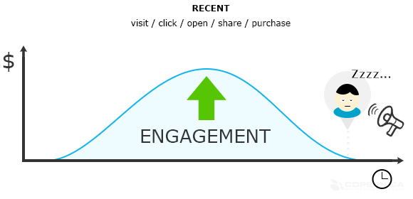

Despite all their best efforts, e-commerce businesses can improve a lot
on their share of wallet from their customers. Although usually there’s
a good strategy to drive traffic to the site, the conversion rates and
turnover from single customers are not as high as they can be. This
article describes three common pitfalls made by e-commerce businesses
all around the world. Find out if your business is getting the most out
of its visitors!

The order process
-----------------

First of all: the order process. A visitor has viewed products and took
the effort of placing them in his basket. Did you know that over [66% of
baskets](http://baymard.com/lists/cart-abandonment-rate "Abandoned baskets | Baymard.com")
get abandoned, and therefore only around 33% of shoppers make it through
the order process?

In our experience, [abandoned cart](./abandonded-shopcarts.md "Abandoned shopping carts")
rates vary highly depending on the type of product that is sold. Typical
abandonment rates are 50% to 75%. And the more easy it is to compare
your product (consumer electronics, fashion), the closer the abandonment
rate will get to 75%.

In a recent pan-European study it was discovered that only 5% of
e-commerce business currently have an [abandoned basket
strategy](./the-use-of-abandoned-shopcart-emails-in-europe.md "Abandoned carts study")
in place.

15 to 25% of people who receive a service-oriented mail within 24 hours
after abandonment will continue to buy their products, so there is a
quick win here.

### Calculation example

Let’s say that your turnover is \$50,000 a month, and your abandonment
rate is 60%. In this case, the 50k turnover is only 40% of your
potential. But by sending a reminder email, you could bring back 25% of
the visitors that didn't checkout their basket. That’s an extra turnover
of ((\$50,000/40%)*60%)*25% = \$18,750 every month!

To do so, however, you will need an opt-in for all of these visitors. If
you have no personal data of the visitors and no opt-in, you will not be
able and not even allowed to follow-up.

Which brings us to the second hole in the pocket of e-commerce
businesses: refraining from collecting data as soon as a web visitor
gets in touch with your brand.

Identifying visitors
--------------------

Smart Insights discovered that the [average conversion
rate](http://www.smartinsights.com/ecommerce/ecommerce-analytics/ecommerce-conversion-rates/ "Average conversion rates | Smartinsights")
from visit to sales is around 4% (and that the average conversion from
visit to basket is 8%, so completely in line with the other research) .
Since 2008, however, conversion rates have been dropping, until they
stabilized at around 4%\
 

So despite the best efforts, 96% of website visitors take off without
any connection with your brand. These visitors might return someday, but
why not stimulate this a bit?

A good way to create a first careful relationship is to engage via
social media with a client. Liking and following is a non-intrusive and
easy way to keep in touch. For business owners today, there are various
applications available to extract data from a social media platform.
Examples of integrations are test panels, news archives and update your
profile pages.\
 

A need to leave details, like email addresses, can also be added to your
site. Try browsing Twitter, Linkedin or Groupon without a login for
example. Offering a reward increases the number of sign-ups. One of the
latest innovations from Bing.com to fend of Google as the \#1 search
engine is [Bing
Rewards](http://www.bing.com/explore/rewards "Bing rewards"), a reward
scheme for searching with Bing.

Lastly, let’s not forget to mention the ugly duckling of identifying
visitors: newsletter subscription forms. Besides collecting opt-ins on
every form on your site, also make sure to publish a subscription form
in the header or footer of your site or alternatively, in the sidebar.

Customer retention
------------------

Perhaps overlooked because you might simply find it unimaginable; the
third ‘window-left-wide-open’ is the one of customer retention. The
sleeping beauties who have bought with you before, but have not checked
back in for a while.

Building on the calculation example we mentioned earlier, the real ROI
will come from timely and relevant communication after the first order.
When you’re able to keep this newly acquired customers engaged with your
brand, the potential is way bigger and marketing costs a lot lower.

Do you know how many of your historical clients are still active today?
How do you measure that?

A [recency, frequency, monetary value
model](http://en.wikipedia.org/wiki/RFM_(customer_value)) is a very good
way of spotting the clients whose eye-lids are slowly closing. Wake them
up, before they go to sleep!

A hotel chain for example applies the RFM model by looking at the most
recent date of booking, total number of bookings of this client and the
total lifetime turnover of the customer and calculates this into a
score.

Engagement can also be measured by someone's activity: besides purchases
this can also be recent website visits, recent behavior with email
newsletters and recent social shares. All of these activities can be
drilled down into a score by applying some basic [lead
scoring](./what-is-lead-scoring-infographic.md "Lead scoring")
techniques.

Closing thoughts
----------------

With paid traffic bringing in a conversion of only 4%, the second half
of conversion starts the moment someone arrives at your site. Improve
customer value by collecting visitor data with a sign-up form, social
integrations and loyalty programs, following up on abandoned baskets and
keeping customers engaged. And finally: predict and win-back your
customers when they are not active any more.

Interested in learning more about these marketing tactics? [Sign
up](https://www.copernica.com/en/copernica-trial "Sign up for a free account")
for a free account today and learn how to apply them directly!
