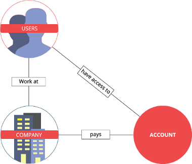

# Accounts and users
The user management module is the place where you can edit your own
information, such as company name or credentials, and also create new logins for colleagues. 
This is also the place to manage access rights to your accounts.
Copernica's account and user management may seem a little complicated. This is because
Copernica works together with a close-knit network of partners. Among these are advertising
agencies, writers and DM and IT companies that support users in using Copernica. All partners
need access to the software for various reasons, because they use the software for their own
campaigns and because they need to be able to look into their clients' accounts. To enable this, we
differentiate between 'users', 'accounts' and 'companies'.

## Accounts and users
Most of the time, a connection exists between an account and a “real world company”. This is why
most accounts are named after companies. For many Copernica users this suffices. For partner
companies, this is a bit more complicated.
A Copernica partner, such as an advertising agency, usually creates multiple accounts, because
they have multiple clients. It's also not unusual for a partner to be called into action to watch along
with an existing Copernica user that wants to use the service of an external specialist. In this case,
the partner does not create a new account. To make this possible, we introduced the concept of
users, accounts and companies:

The triangular relationship as pictured above makes it possible to grant different sorts of access to accounts. A
partner, for example, can create an account and grant access to their own employees, as well as
some employees of the client of the partner.
It is also possible for a company to grant access to someone who doesn't work at the company
(such as an external marketing specialist). The triangular concept allows these kinds of relations as
well. In the user dashboard you can create these types of relations to your liking, depending on your
access rights.

## How does this work in practice?
In both the old Publisher and the new MarketingSuite, it's possible to keep users, accounts and
company information. In both environments you can link users to companies and accounts. If
you're a regular user, i.e. a single account with a few colleagues, this may look a little superfluous:
a list of colleagues and a list of people with access to the account, while these are often the same
list.

As described, this is because of the triangular structure, which you can use in the case of multiple
accounts, or if you want to grant access to a non-colleague.

