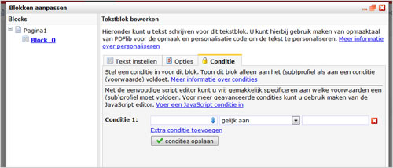

Just like the content blocks you use in emailings and websites, their
PDF counterparts can be shown conditionally.

This enables you for example to show different content to male and
female customers or subscribers (assuming that you know their gender).

These conditions are created in the tab Conditions, at any text or image
block of the PDF document.

### Using the easy script editor

The easy script editor allows you to make conditions without any coding
skills.

-   Choose the field that you want to use for the condition rule. It is
    important that this field is in the same database you are targeting
    the PDF to.
-   Choose the comparison type, and then the value you want to compare
    with.
-   Click 'Add extra condition' to add additional conditions. Make sure
    you use the correct comparison mode.

- AND -

The block is included in the PDF if all conditions validate to true.

- OR -

The block is included if the target profile or subprofile meets at least
one condition

### Javascript editor

If desired, you can use the JavaScript editor for writing more extended
conditions, by clicking on the link 'Enter Javascript Condition'.

A simple comparison in JavaScript could look as follows:

profile.Gender == 'female';

(the block is only included if the value of the field Gender is equal to
'female')
