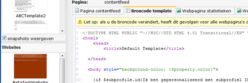

Web pages are created based on web templates. In the template you
determine the layout and styling of your page. It also incorporates
variable elements, that can be given content on page level. These are
known as text, image and loop blocks.

### Creating the template

You can create a new template, copy an existing template or import a
template from your computer. Creating your own web template requires
HTML knowledge. If your organization does not have an HTML expert you
may use one of the [default
templates](./emailings.md), import a
template from an external source or have one of [Copernica's
partners](http://www.copernica.com/en/get-started-with-copernica/partners-overview) create
a template for you.

-   **Create a new template.** From the template menu, choose *New
    template... *and create a basic template using HTML code and content
    blocks.
-   **Import a template.** First create a new (empty) template. Then
    select *Import template *from the *Template *menu. Locate
    the *HTML*or *ZIP *file (if you included images) on your
    computer and *upload *it to the application.
-   **Use an email template: **Email templates can serve as a basis for
    web pages. Under *Websites*, create a new template, and then choose
    the option *Copy web template or email template*. Copied templates
    can easily be edited. This does not affect the original email
    template.

#### Editing the template source code

Once you have followed the above steps, you can edit the template source
code from the Template source tab.

1.  **Click on the template** in the left overview to select the
    template (if it is not already selected).
2.  Your template will be opened in the template work space.
3.  **Click on the Template source tab**. Type something and click on
    store. Hooray, your template is created.

#### Adding the template content blocks

In the template source code you can use special code to create [text
blocks](./the-text-function-for-adding-textual-content-to-your-document.md), [image
blocks](./the-image-function-for-adding-images-to-your-document.md) and [loop
blocks](./the-loop-function-to-iterate-content-in-your-email.md).
You can add as many blocks as you want to your template, as long as they
have different names.

**Text blocks **are used to add textual content to your email document.
However anything is allowed in text blocks.

> `[text name="TEXTBLOCKNAME"]`

As with text blocks, it is also possible to determine where users
can **add images** to the email document. Just include the following
line of code in the template source where you want the image to be
added: 

> `[image name="IMAGEBLOCKNAME"]`

**Loop blocks **are used to repeat image and text blocks within your
document. For example, if you wanted a newsletter sent weekly that
contained different amounts of images, you could create a loop around
the image block. This would allow you to choose how many image blocks to
include in the document, without changing the HTML.

> `[loop name="LOOPNAME"]         Source code that should be repeated     [/loop]`

A loop and text block used in the template HTML source
