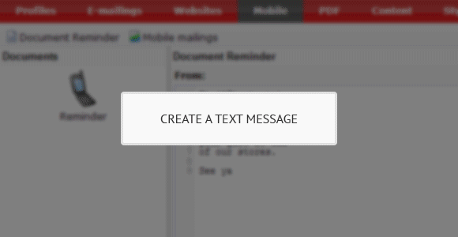

Copernica offers cross medial solutions for your marketing campaigns.
Because in this day and age pretty much everyone has a mobile phone, you
also have the possibility to easily create mobile marketing campaigns.
Whether it's a plain text message, or a personalised text message you
want to send to a
[selection](./define-target-groups-with-selections.md "Segment using selections")
from your
[database](./creating-your-own-databases.md "Creating your own database"),
Copernica offers the solution!

Creating a text message in Copernica
------------------------------------

Using the WYSIWYG editor in Copernica to create mobile text messages,
you can compose a text as long as you want. When a message contains more
than 160 characters, Copernica will automatically split the message in
multiple text messages.

Personalise your text message
-----------------------------

Would you like to
[send](./send-emailings-to-relations.md "Send emailings with Copernica")
a personalised text message to your contacts? Easily add contact details
to a text message with Copernica. Because of Smarty tags, a template
engine for PHP, it's possible to personalise text messages with all
information you have stored in
your [database](./creating-your-own-databases.md "Creating your own database").
