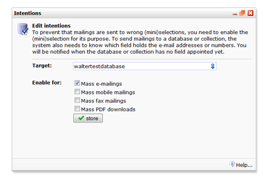

This function under **Database management** allows you to set which
**databases** and **selections** can be used to send mailings to.

You have to set this separately to prevent accidental mailings to the
wrong groups of people.

To send mass mailings to a database, you need to tell the application
first in which field the email addresses are stored. You will be promted
when no such field is set yet.

The notice offers an option to assign a field immediately.
