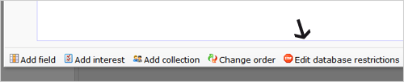

Database restrictions help you keep your database orderly and clean. For
example you could enforce that the database field with email addresses
may never be empty or that an email address may only appear once.

This function is found under Profiles \> Database management \> Edit
fields \> **Edit database restrictions**.

Database restrictions are certain conditions that can be configured on
your database and/or collections. If you add a restriction rule to a
database, any profile or subprofile in the database must satisfy this
rule. If unauthorised values are entered, the profile cannot be stored
or changed. Database restrictions are often called
*[constraints](http://en.wikipedia.org/wiki/Database_constraints#Constraints)*.

Data entered within the marketing software and your Content web forms
must satisfy the restriction.

Create the restriction
----------------------

A database restriction is created in a few steps

-   Select the database.
-   Choose **Edit fields...** in the Database management menu.
-   Click **Edit database restrictions.**
-   **Enter a name** for the new restruction and optionally a
    description.
-   Click on the link to **add a condition** for the restriction.

### Block values or block duplicates

Database restrictions can be (separately) configured for databases and
collections. \
 We differentiate between two restriction types:

-   **Block certain field values:** Choose this restriction type if you
    want to create restrictions to allow only certain kind of field
    values (or which values should be blocked).
-   **Block doubles:** Choose this type to prevent two or more
    (sub)profiles from having the same value in a certain field (e.g.,
    the value of the field ‘Username’ must be unique).

### Block certain field values

Add a rule by field value to avoid or enforce certain values of that
field. For example the field 'Age' must contain a number greater than
'18'. Or the field 'mobile number' must always contain the numbers
'077'.

In the conditions tab, choose the field and how it should be compared
with the given value. The options here are very descriptive and
straightforward and therefore should not raise any questions if you are
already familiar with [creating
selections](./working-with-selections.md).

A restriction can be enforced on the value of a field, or on a
combination of fields

### Block doubles

Add a rule to block double field values, if profiles can only be added
to the database if a certain value is not already occurring. For example
if there's already a profile with the e-mail address
'chucknorris@yahoo.com', a new profile cannot be stored if it uses the
same e-mail address. Or check both 'street' & 'city', if the combination
of those field values should be unique.

**When adding a rule, please note:** \
Like with selections and miniselections, rules to restrictions can be
combined. If you add a condition AND another condition in the same rule
- the profile can only be valid if it adheres to both conditions. If you
add a conditions to two different rules (OR) - the profile is valid if
it adheres to one of these rules.

-   [Read more about OR and AND
    rules](./or-and-and-selection-conditions.md)

### (Temporarily) disabling database restrictions and restriction rules

Like with selections and miniselections, database restrictions and its
individual rules can be temporarily disabled.

To disable a restriction : select ‘**This restriction is not in use**’
which can be found in the Name and description tab.

To disable a restriction rule, select ‘**This condition is disabled**’
in the conditions tab.

**Important note:** If a restriction has one single ‘OR’ rule which is
completely disabled, no (sub)profile fields will match the restriction
resulting in all profiles being blocked by the restriction. You will be
warned in the application if such is the case.

### Database restictions and web forms

If you have database restrictions, this also affects how web forms work.
The submitter will not be able to submit his data if it's violating a
restriction on your database or collection(s). In the web form behaviour
wizard, you will come across an option to edit the error message that is
communicated to the visitor when a restriction is violated.
