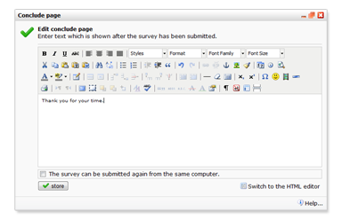

Survey participants are redirected to the survey conclude page after
they submitted the survey. The content of this page can be edited.

-   Choose 'Edit conclude page...' in the survey menu.
-   Enter the information you'd like to show to the participant.

The conclude page is displayed with the same lay out as the survey.

Unfortunately, personalization does not work in the conclude page.

Both the rich and the HTML editor can be used to edit the content of the
conclude page.

### Redirecting to your own page

To skip the default conclude page, use the HTML editor to add the
following javascript code to create the redirect.

``
