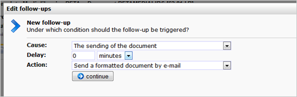

# Followups for mailings

You can create automated responses on your email documents. Each time a
document is sent, someone clicked or registered an impression, a
follow-up action can be activated for this destination. You set under
which conditions the follow-up should be triggered, and which action
should follow.

To make a new follow-up (or edit an existing one), go to the document
under Emailings, then choose **Follow-ups...** from the *Document* menu.
Your follow-ups can also be accessed from the **Follow-ups** tab at the
document.

## Cause and action

A follow-up action consist of two parts: the cause and the action. When
creating a new follow-up action, you are first asked to choose the
cause.

You can choose from 4 different causes for the document follow-up
action:

-   **The sending of the document**- the follow-up is always activated
    for each destination in your mailing
-   **The registration of an impression** - the follow-up is only
    activated when the recipient has opened your email
-   **The registration of a click**- the follow-up is only activated
    when the recipient clicked on a link in your email (any link, or a
    specific link)
-   **The registration of an error**- the follow-up action is activated
    only if the delivery of the email resulted in a (specific) error

-   **Delay**: the follow-up action can be executed directly (set: 0
    minutes) or after the period you specify here (for example, one week
    later).
-   **Action:** The actual follow-up action. Choose what should happen
    if the follow-up action is triggered. This may be sending an email
    to the profile or something else.

## Additional conditions for the follow-up actions

Sometimes you want to prevent that a follow-up action is scheduled or
executed. For example, the follow-up should only be scheduled when the
submitter of the form is a customer, not a supplier. Or to prevent that
a follow-up email is not sent to people who have unsusbcribed in the
meantime.

There can be days, weeks, or even years between the scheduling and the
actual execution of a follow-up action. Therefor we differentiate
between **schedule conditions** and**action conditions.**

-   Create a **schedule condition** to ensure that the follow-up action
    will be scheduled under certain conditions only
-   Create an **action condition** to ensure that the follow-up action
    is executed under certain conditions only

## More information

* [Followups in publisher](./followups-publisher)
* [Followups for mailings in publisher](./followups-publisher-mailing)
* [Followups for web forms in publisher](./followups-publisher-web-forms)

