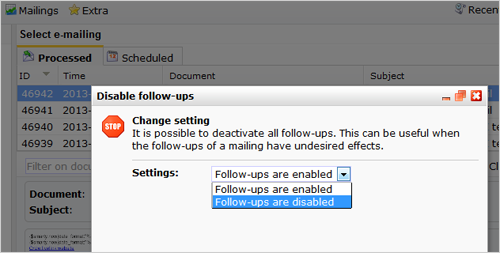

It is possible to (temporarily) stop all follow-ups of a mailing. Use
this kill or cure remedy if the follow-ups have undesired or unforeseen
results.

First choose the mailing in question from the **Statistics** overview.
Then use this option from the **Mailings menu.**

### Remove follow-ups

All follow-ups can also be stopped by choosing 'remove' from the 'Edit
follow-ups' dialog . It is not (yet) possible to temporary disable
follow-up actions other than mailing follow-ups.
