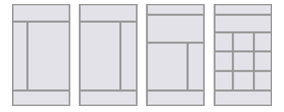
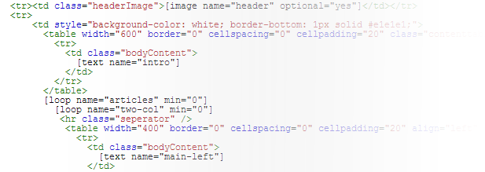

# Building email templates

Creating your own template requires some knowledge of HTML. To be able
to have more control over the code, we advise you to use a text editor
to create a template, rather than using a WYSIWYG editor

[Notepad ++](http://notepad-plus-plus.org/) is a free open source text
editor and perfect for creating HTML files.
The best email templates are still built with tables. New techniques
can better be avoided completely. Please refer to our HTML email
template guidelines article for more information.

**No HTML knowledge or design skills, still want a great template?**
Refer to our [Partner
Program](https://www.copernica.com/en/support/find-a-partner) to search
for a partner suitable for this job.

A template starts with an idea and a design. Build your template in a
way so that it can be reused over and over again. Determine how many
columns the template should have, and in which way you want to iterate
the different articles in the document later on.

Most email templates have a header, two columns (one for a table of
contents and for the articles), and a footer (often with contact data,
and the unsubscribe link).

### Take into account the following

When developing your HTML template, keep in mind that your email
documents will be rendered in email software, like Outlook Express,
Gmail, Hotmail, but also increasingly on the smartphone and tablet. Most
of these programs hardly support modern internet standards.

Hence designing for these programs comes with some limitations. There is
for instance less space available to show your document, so use a
maximum width of 650 pixels for your design. Also, many common web
technologies, like JavaScript, Flash and CSS positioning are not
supported in email clients. 

-   For your lay out, use oldschool HTML tables instead of CSS
    positioning.
-   Make each component in your template a separate table (nested
    tables). This way, the template will be easier to maintain.
-   Do not use margins and paddings, instead use a blank table cells.
    Use a [blank
    pixel](http://www.copernica.com/en/support/what-is-pixel-gif) to
    capture the width and height of the margin cell. Among others, Gmail
    does not support CSS margin and padding.
-   Ensure that the images / text ratio does not exceed 1:1 in favour of
    the images.

### Adding content blocks

Within the HTML source code you can use special tags to indicate where
the end user can add content to the documents based on the template.

-   **[Text
    blocks](./the-text-function-for-adding-textual-content-to-your-document.md)** are
    used to add textual content to the document.
-   **[Image
    blocks](./the-image-function-for-adding-images-to-your-document.md)** are
    used to add images to the document.
-   **[Loop
    blocks](http://www.copernica.com/en/support/the-loop-function-to-iterate-content-in-your-email)** are
    used to iterate the content between its opening and closing tags.

\
**Img:***Code snippet of the Copernica newsletter, with image, text and
(nested) loop blocks. *\
\

#### Additional options for content blocks

All three types of blocks can be extended with additional options. For
example you can limit the number of times a loop may be iterated in the
document, and that an image may not be higher than 200 x 200 pixels. 

It is also possible to add leading and trailing HTML to a content
block. This HTML is then only loaded if the block is actually used in
the document. This is for example useful if an image should always be
loaded within a HTML table, but you want to avoid this table to be
loaded in the document if the image is not used.

You can specify these additional settings for the content blocks using
special parameters. These options are further explained in the
help articles on the individual content block types.\
 When you have uploaded the template to the software, you can also
change the properties of the content blocks under *Template menu* \>
**Edit block structure**.

### Automatically display the current date in your template

Using Smarty code you can automatically display the current date and
time in your document.

Use the smarty code {\$smarty.now}. With the modifier |date\_format you
can specify how the date is diplayed.

**Example:**{\$smarty.now|date\_format:"%A"} only displays the current
day.

[More examples of
smarty.now](./using-the-smarty-date-function.md "Smarty.now modifier")

### Including a webversion of your email

The
[webversion](./link-to-the-webversion-of-your-email.md) offers
a solution for the recipient who cannot read HTML newsletter in
their email program. \
\
 The web version is added to your template using the following tag:

`{webversion}`

Note that the tag itself only generates a (for each recipient unique)
URL. To make this URL clickable some HTML code is needed.

`<a href="{webversion}">View the webversion</a>`

### Adding the unsubscribe link

A commercial email should always be equipped with a prominently placed
unsubscribe link. The unsubscribe link is quickly and easily added using
the {unsubscribe} Smarty tag. Do not forget to set the unsubscribe
behaviour on the target database as well, to make sure that unsubscribe
requests are properly processed.

`<a href="{unsubscribe}">Click here to unsubscribe</a>`

-   [Read more about the unsubscribe
    link](https://www.copernica.com/en/support/the-unsubscribe-function)
-   [Read more about setting the unsubscribe
    behaviour](./setting-unsubscribe-behaviour-for-your-database-or-collection.md)

### Using Smarty personalization

Templates and documents can
be [personalized](./personalize-campaigns.md)
with information from the (sub)profile (the recipient). This makes
it possible, -for example- to start an email with a personal opening.\
\
 Suppose you want to show the recipient's name in the email. If the name
is stored in the database field 'Name', then you can display the value
from this field the template or document with personalization code
{\$Name}.

Note that smarty code is case sensitive. {\$name} is something different
than {\$NAME}

You are allowed to use Smarty code in the HTML source code. This makes
it possible to display a different lay-out based on the recipient
characteristics.

`{if $Gender == "Male"}Some HTML code{else}Different HTML code{/if}`

### Uploading the HTML template to the software

If you have images included, it is advised to create a zip file that has
both the HTML file and the used images included. Once you imported the
template, the images are automatically added to its files and images
folder (which can be accessed from the Template menu). \
\
 The template import function can be found in the template context menu
under *Emailings*.

### Template text version

Once you imported the template into the software, you can add a [text
version](./add-email-text-version.md) in
the text version tab. It is however advised to create a text version for
the individual documents based on the template, not the template itself.

### Create a document with the template and edit its content

To create a document, click on the template name in the left overview,
go to the *Document* menu, and then click *New document.*..

Enter the name of the document and click *Store*.

To start adding content to the document, click *Edit mode* at the bottom
of the open document. The content blocks that you have defined in the
template source code, will now become clickable. Click on a block
to edit its contents. To see the document as it would be sent,
click on *Preview mode* in the bottom of the document .

At the top of the document you can enter the [sender data and subject of
the
document](./sender-subject-and-other-email-headers.md "Email headers").
