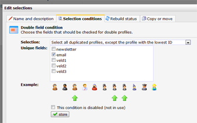

Having duplicate profiles in your database or collection is a common
problem. Fortunately they are easily removed from your
database/collection or excluded from your newsletter selection.

### Removing or excluding double profiles

Wether you want to delete duplicates, or just exclude them from your
mailing, you'll need to [make a
selection](./selections-and-miniselections.md)
in your database and choose the condition type **Check duplicate or
unique profiles**.

This condition type provides you with different methods to select
**double or unique profiles**. Pick the one that fits your needs best.

### Step 1: Choose the method that fits your needs

The selection condition offers 6 different methods for removing doubles.

1.  Select all duplicated profiles
2.  Select all unique profiles
3.  Select all duplicated profiles, except the profile with the lowest
    ID
4.  Select all duplicated profiles, except the profile with the highest
    ID
5.  Select all unique profiles and only the lowest ID for the duplicated
    ones
6.  Select all unique profiles and only the highest ID for the
    duplicated ones

Important: the profile ID's in your databases are **incremental**. If
you have two duplicate profiles, the profile with the lowest ID is the
oldest one. All duplicate profiles with a higher ID can thus be
considered duplicates.

### Situation: Profiles appear double in my database after I imported a file. Now I want to remove the duplicates (according to the last in first out principle).

Choose option 3. When you have created the selection, remove the
profiles from the selection (*current view \> remove profiles*) and run
the import again. This time use [key fields](./what-are-key-fields.md).

### Situation: I never want duplicate profiles to appear in the selection where I send my mailings to.*\
*

Choose option 5.  Add the condition to the selection where you send your
emails to, or refer to the selection from your newsletter selection.

The duplicate and unique profiles selection type lets you select
profiles that appear more than once, based on a unique identifier and
their age (ID).

### Step 2: Select a unique field

Choose on which field you want to base the selection. In most databases
the email address is very suitable for this. You can also use multiple
fields if only the combination of those fields must be unique.

### Step 3: Click on store to save the selection

Always double check if you have selected the right profiles before you
remove or email anything!
