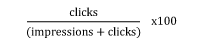

\
 CTR = clicks / (impressions + clicks) \* 100

For example, the click through rate on a **120-impression** e-mail
campaign, where **12**people have **clicked**through to your website, is

(12 / (120 + 12)) \* 100 = 9%
