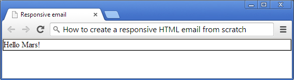
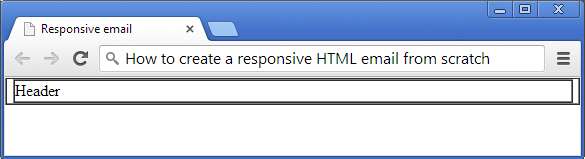
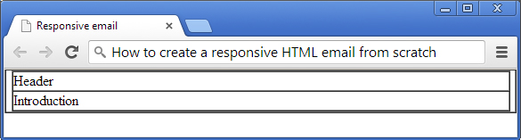
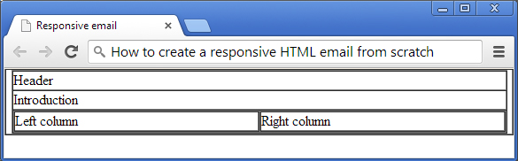
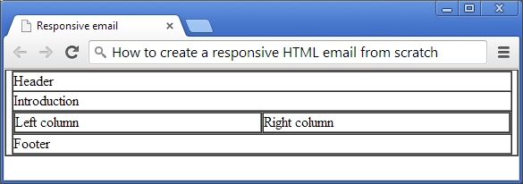
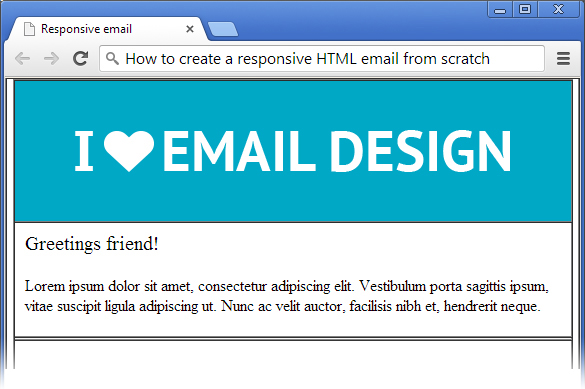
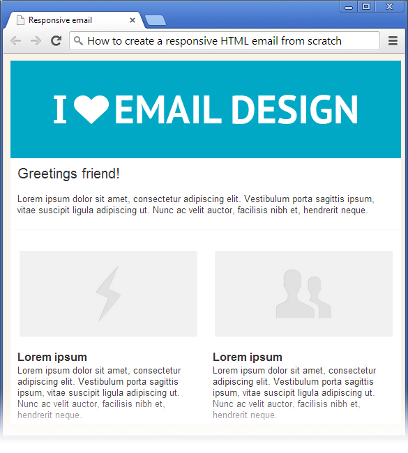
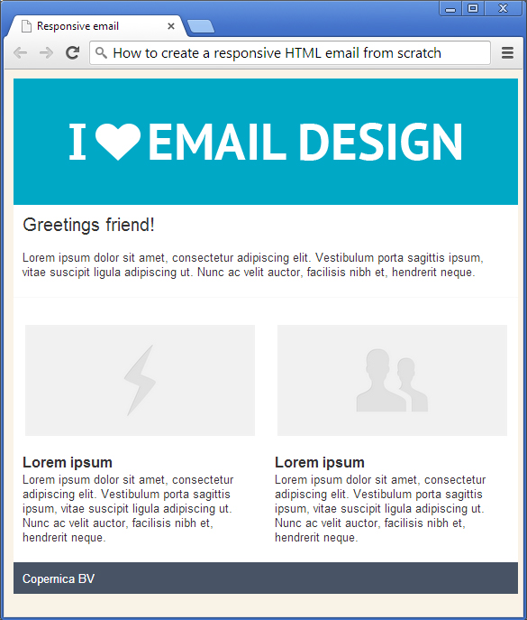

You must have heard this question before: will our newsletter look nice
on an iPhone? Or, why doesn't our email look just as nice as our
competitor's email? I'm going to teach you how to create an email
template that will look nice on an iPhone, Android or Windows8 phone. In
other words, today you are going to learn how to create a
[responsive](./responsive-design-preparing-your-emails-for-mobile.md "Responsive design: preparing your emails for mobile")
HTML email from scratch.

Before you continue…
--------------------

I'm assuming you already have the necessary skills for developing HTML
emails. Therefore I will not get into the nitty gritty details of things
to take into account when you're coding for different email clients.
However, I will cover specific responsive issues. But basic knowledge of
HTML/CSS should help you on your way. Not want to go through the hassle?
Try our new [ResponsiveEmail.com
service](https://www.responsiveemail.com/ "ResponsiveEmail API homepage").

Final product
-------------

What you'll be creating is an email that looks great on a desktop
computer and a mobile (smart)phone like an iPhone. See below.

\

[Download the source
files](Copernicacom/responsive-email-copernica-source.zip "Download the source files")

The Basics
----------

Every HTML document starts with a DOCTYPE, followed by the HEAD section,
BODY and so on. Create a new HTML document and use the following code:

~~~~ {.language-markup}
<!DOCTYPE html >
    <html>
        <head>
            <meta http-equiv="Content-Type" content="text/html; charset=utf-8"/>
            <meta name="viewport" content="width=device-width, initial-scale=1.0"/>
            <title>Responsive email</title>
            
        </head>
        <body>
            <table border="1" cellpadding="0" cellspacing="0" width="100%">
                <tr>
                    <td>
                        Hello Mars!
                    </td>
                </tr>
            </table>
        </body>
    </html>
~~~~

Nothing extraordinary as you can see, except for the viewport meta tag.
Basically this tag tells the email client (or browser) to assume that
the email is as wide as the screen width of the device. I'm using a
table as container that spans across the full `width of the page`. You
can also use this container to style your email with a background color
since CSS stylings on the body tag is ignored by a couple of email
clients. Let's call this table the main container throughout this post.

**Note:** Make sure you set the cellpadding and cellspacing to zero to
prevent weird spacing issues in Outlook. For the sake of this tutorial
I’m leaving the border of the table on so you can see the process.

Your HTML page should look like this:

Layout structure
----------------

Next is the layout structure of the design. Let's go back to the final
design you saw at the beginning of this post:

-   First we have the header, which contains an image.
-   Second an introduction
-   Third I have two columns and last but not least the footer.

The width of the email is set to 640px. So let's go ahead and start
writing the rest of the HTML code.

### Coding the layout structure: header

The header will be wrapped inside of the main container table you saw
earlier. The one that spans across the full width of the page. The code
is as follows:

~~~~ {.language-markup}
<table border="1" cellpadding="0" cellspacing="0" align="center" width="640">
    <tr>
        <td>
            Header
        </td>
    </tr>
</table>
~~~~

Make sure you've placed the code above inside the main container table.

### Coding the layout structure: introduction

The structure of the introduction is similar to the header, so go ahead
and copy that code and paste it below the header code.

~~~~ {.language-markup}
<tr>
    <td>
        Introduction
    </td>
</tr>
~~~~

Your HTML page should look like this:

### Coding the layout structure: two column article

One of the characteristics of a responsive email is that for example two
columns aligned next to each other, are stacked on top of each other
when viewed on a smaller screen. The first approach, for a
non-responsive design, would be to create a single table with two table
cells inside. But that would make it difficult to play nice on smaller
screens. So we are going to create two tables next to each other
instead. The table on the left will need to align to the left and the
right table will of course need to align to the right. Take a look at
the following code:

~~~~ {.language-markup}
<tr>
    <td>
        <table border="1" cellpadding="0" cellspacing="0" align="left" width="49%">
            <tr>
                <td>
                    Left column
                </td>
            </tr>
        </table>
        <table border="1" cellpadding="0" cellspacing="0" align="right" width="49%">
            <tr>
                <td>
                    Right column
                </td>
            </tr>
        </table>
    </td>
</tr>
~~~~

Place this code right below the 'introduction'. Your HTML page should
look like this:

### Coding the layout structure: the footer

The footer looks a lot like the header structure doesn't it? Go ahead
and copy the code of the header and paste it below the two columns.

~~~~ {.language-markup}
    <tr>
        <td>
            Footer
        </td>
    </tr>
~~~~

Your HTML page should look like this:

Content & style
---------------

You should now have a solid foundation of the layout structure of the
email design. We can start adding content and different styles to make
it look shiny and all. And most important make it look nice on a mobile
device.

### Adding content & style: header

The header only consists of a single image. So that's easy. Replace the
text 'Header' with an image of your own or the one available in the
source files you can download. Take a look a the code below:

~~~~ {.language-markup}
<tr>
    <td bgcolor="#00A8C6" style="font-size: 0; line-height: 0; padding: 0 10px 0 10px;" height="140" align="center" class="responsive-image">
        
    </td>
</tr>
~~~~

Before you say anything, I'm aware that I'm using padding. Padding
doesn't work well in email clients. But believe me, it's safe to use
padding on TD tags but not on \<div\> or \<p\> tags. Remember that you
must always specify every value (top, right, bottom & left). I've added
a special class, responsive-image, that I'm going to explain to you
later regarding responsive design.

### Adding content & style: introduction

The introduction section consists of a title, a short summary and a
horizontal gray line used as a seperator. To keep things simple I'm
using break tags (\  for new lines and the content is placed
inside divs to be able to style them separatly. For instance: setting
the font size of the title 'Greetings friend!' to 20px.

White-space is an important factor in design and creating white-space
when coding HTML for email can sometimes be a pain. I'm using padding to
create white-space around the introduction. The bottom part of the
introduction gets an extra 10px. When padding is not the right solution
for your design, you can always use
[spacers](http://en.wikipedia.org/wiki/Spacer_GIF "spacer gif") to
create white-space. I use a slightly different technique that doesn't
require an image as a spacer. Here is an example:

~~~~ {.language-markup}
<tr><td style="font-size: 0; line-height: 0;" height="30">&nbsp;</td></tr>
~~~~

Simply set the font-size and line-height of the container, in this case
a TD tag, to zero and set the height of the container to the amount of
white-space you would like to create. Don't forget to fill the TD tag
with &nbsp; since email clients don't like it when you leave your table
cells empty. It can break your email layout for example.

So, I'm using the 'image-less' spacer technique to create the gray
horizontal line instead of using the good old \<hr\> tag. The main
reason is because Outlook ignores the styling you apply to the tag to
make it nice and thin.

This is the code

~~~~ {.language-markup}
<tr><td style="font-size: 0; line-height: 0;" height="1" bgcolor="#F9F9F9">&nbsp;</td></tr>
<tr><td style="font-size: 0; line-height: 0;" height="30">&nbsp;</td></tr>
~~~~

Notice the extra 'spacer' code I've added below the gray line? This is
because padding would not have worked. The padding would have added
extra pixels and make the line a bit thicker than it should.

Your code should look like this:

~~~~ {.language-markup}
<tr>
    <td style="padding: 10px 10px 20px 10px;">
        
Greetings friend!

         
        

            Lorem ipsum dolor sit amet, consectetur adipiscing elit.
            Vestibulum porta sagittis ipsum, vitae suscipit ligula adipiscing ut.
            Nunc ac velit auctor, facilisis nibh et, hendrerit neque.
        

    </td>
</tr>
<tr><td style="font-size: 0; line-height: 0;" height="1" bgcolor="#F9F9F9">&nbsp;</td></tr>
<tr><td style="font-size: 0; line-height: 0;" height="30">&nbsp;</td></tr>
~~~~

And your HTML page should now look like this:

### Adding content & style: columns

Let’s add some images and content to the columns. I'm using divs so the
content behind the title will start on a new line. Throw in a break tag
for extra white-space if you like.

Add an image

~~~~ {.language-markup}
<tr>
    <td style="padding: 0 10px;" align="center" class="responsive-image">
        
    </td>
</tr>
~~~~

Add extra white-space below the image

~~~~ {.language-markup}
<tr><td style="font-size: 0; line-height: 0;" height="20">&nbsp;</td></tr>
~~~~

Add a short summary. I'm using lorem ipsum.

~~~~ {.language-markup}
<tr>
    <td>
        
Lorem ipsum

        

            Lorem ipsum dolor sit amet, consectetur adipiscing elit.
            Vestibulum porta sagittis ipsum, vitae suscipit ligula adipiscing ut.
            Nunc ac velit auctor, facilisis nibh et, hendrerit neque.
        

    </td>
</tr>
~~~~

Add extra white-space below the summary

~~~~ {.language-markup}
<tr><td style="font-size: 0; line-height: 0;" height="20">&nbsp;</td></tr>
~~~~

Repeat above for the right column and your code should look like this:

~~~~ {.language-markup}
<tr>
    <td>
        <table border="1" cellpadding="0" cellspacing="0" align="left" width="49%">
            <tr>
                <td style="padding: 0 10px;" align="center" class="responsive-image">
                    
                </td>
            </tr>
            <tr><td style="font-size: 0; line-height: 0;" height="20">&nbsp;</td></tr>
            <tr>
                <td>
                    
Lorem ipsum

                    

                        Lorem ipsum dolor sit amet, consectetur adipiscing elit.
                        Vestibulum porta sagittis ipsum, vitae suscipit ligula adipiscing ut.
                        Nunc ac velit auctor, facilisis nibh et, hendrerit neque.
                    

                </td>
            </tr>
            <tr><td style="font-size: 0; line-height: 0;" height="20">&nbsp;</td></tr>
        </table>
        <table border="1" cellpadding="0" cellspacing="0" width="49%">
            <tr>
                <td style="padding: 0 10px;" align="center" class="responsive-image">
                    
                </td>
            </tr>
            <tr><td style="font-size: 0; line-height: 0;" height="20">&nbsp;</td></tr>
            <tr>
                <td>
                    
                    
Lorem ipsum

                    

                        Lorem ipsum dolor sit amet, consectetur adipiscing elit.
                        Vestibulum porta sagittis ipsum, vitae suscipit ligula adipiscing ut.
                        Nunc ac velit auctor, facilisis nibh et, hendrerit neque.
                    

                </td>
            </tr>
            <tr><td style="font-size: 0; line-height: 0;" height="20">&nbsp;</td></tr>
        </table>
    </td>
</tr>
~~~~

**Note:** Just like the image in the header, I've added a special CSS
class 'responsive-image' to the container of the images.

Your HTML page should look like this. By the way, I seem to have turned
off the borders of my tables in this screenshot and added a bit of basic
CSS styling. Not to worry, update the CSS inside the HEAD with the
following code:

~~~~ {.language-markup}

~~~~

### Adding content & style: footer

The footer will only need a name and a background color. No Rocket
Science there.

~~~~ {.language-markup}
<tr>
    <td bgcolor="#485465" style="padding: 10px 10px 10px 10px; color: #FFFFFF;">
        Copernica BV
    </td>
</tr>
~~~~

Your HTML page should now look like this. You're almost there!

Add some responsiveness
-----------------------

I'm using media queries to make things responsive. Media queries is a
technique to make an HTML design act responsive. Another technique is to
create your designs fluid by using percentages for widths. Media queries
give you a bit more control over your design.

Place the code below in HEAD section of your email HTML document. You
can paste it right after the last CSS styles you've placed a few steps
earlier. I'll break it down in the next paragraph.

~~~~ {.language-markup}

~~~~

What the media query code tells mobile email clients (and browsers) is
that below the 480px threshold, a mobile-friendly layout should be
displayed

The width of every table is set to 100% width. And I'm using !important
to over-ride the fixed-widths from tables.

The '.responsive-image' class does almost the same for tables, but only
for images.

**Note:** Media queries only work when embedded into the HTML. Basically
this means that you cannot use it as inline styles.

Quick tip if you're using Copernica Marketing Software
------------------------------------------------------

Copernica has a very handy tool that puts your CSS inline, which is
really what you should be doing anyway. Having said that, after you have
created your email template in Copernica, make sure you set the [style
setting](./automatically-convert-block-style-elements-to-inline-style-attributes.md "style setting")
to *keep the \<style\> blocks and convert to style= attributes*. You can
find the style setting in the dropdown menu of the selected email
document.

That's it!
----------

If you have followed the steps above you should now have an email that
looks great on mobile devices! Now go and impress your clients or boss.
Please do share your own design or if you have any tips, let us know!

Create fully responsive emails without HTML and CSS
---------------------------------------------------

Do you want to create fully responsive emails without any of the hassle
of HTML and CSS? Try our new [ResponsiveEmail.com
service](https://www.responsiveemail.com/ "ResponsiveEmail API homepage").
