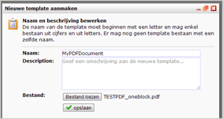
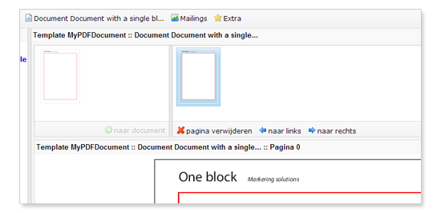
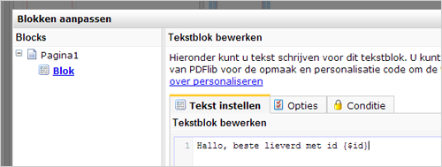

# Importing a PDF

After you provided the PDF file with PDFlib blocks in Acrobat Pro, you
can import the PDF document to Copernica.

### Import PDF document

Make sure you are in the PDF section of the software.

Import to new template

-   Create a new template in the *Template menu*
-   Give the template a descriptive name
-   Locate the PDF file on your computer and then click store.

Overwrite existing template

-   Select the template you want to overwrite, and then choose **'Import
    template**' in the *Template menu*.

### Create the document

Just like with email documents, your PDF documents are created with a
template.

-   Select the template you want to use.
-   Click **New document**in the *Document menu*
-   Choose a name for the Document and click on store.

You can add infinite documents under one template.

### Add pages to the document

A PDF document can have multiple pages. In Copernica you indicate which
pages you want to include in the final document.

You do this by selecting the page in the list on the left side, and then
click **'to document**'.

Dynamic text or image blocks that you created with with the PDF-lib
plugin are now red bordered, indicating that it can be clicked to edit.
Click the bordered area to edit the contents of the block or
alternatively click "**Edit blocks**" in the bottom of the screen.

Note, after saving the content of a block your changes are usually not
directly visible. This is because the document preview is processed on a
remote server at PDFlib.

To see the result of your work immediately, you can download the
document. You can download the personalized document (with data from
your test destination) with the so-called function in the *Document
menu*.

If you still don't see any results, there might be something wrong with
your block configuration, or you haven't uploaded the used font yet to
Copernica. [Read how you can solve issues with your personalized PDF
document](./pdf-blocks-formatting-what-should-you-take-into-account.md).
