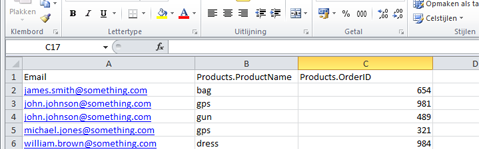
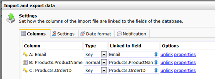
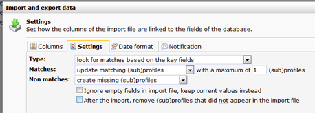
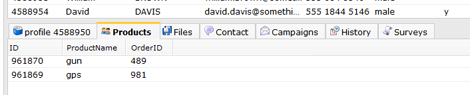

This article will guide you through the process of updating a collection
in your Copernica database with data from an import file. New
subprofiles will be added to the collection of the parent profile.

**NOTE:**With this type of import you can affect all existing data at
once. This action cannot be undone. You should therefore perform the
import with great caution and double check your settings carefully
before you start importing.

Step one: creating and uploading the file
-----------------------------------------

-   Create your import file, and [convert it to a tab delimited txt
    file](./the-requirements-for-a-well-formatted-import-file.md).
-   Under Profiles, **click on the database** that you want to update
    with the new data
-   Choose **Import / Export files**from the **Current view**menu. Then,
    click **Import**

### Database and collection fields {.image_caption}

The marketing software can distinguish database and collection fields
through a dot between the collection name and the field name:
*Collectionname.fieldname*

-   **Locate the import file** on your computer, and **proceed to the
    next step.**

Step two: linking the fields, choosing the key field
----------------------------------------------------

The import dialog has four tabs. The **columns tab**allows you to link
the columns from the import file to the fields from your database and
collection.

**Note:**If the colunm names from your import file match with database
field names, they are automatically linked. If they do not match, you
can link them manually.

You can create missing database fields directly by clicking on the
'**find or create field**’ button. A [text
field](./database-and-collection-field-types.md)
will be created in the database. Click **Properties** to make the field
with the desired settings. You may of course alter these settings at a
later time from the*Database Management menu \> **Edit fields**.*

**Note:** Data from non-linked fields is not imported. It is not
required to link all fields.

If no fields were found, create them individually or in once by clicking
on **Create all fields**.

#### Key fields

To synchronize data, or when importing data to a collection, you need to
set [key
fields](./what-are-key-fields.md). The
key field must contain a unique value for each profile and subprofile,
needed by the application to link the import rule with an existing
profile and to link a profile to a subprofile. If you do not have a
field with unique values, it is possible to use multiple key fields
which are combined unique. Fields suitable for key fields include the
profile ID, a customer number or the recipients email address.

Key fields are chosen manually. The application warns you if no key
fields have been set yet.

In the example below, the database field *Email* and the field
*ProductID*from the collection *Products*will be used as the key fields.

The fields are now linked, the default field *ID* and the collection
field *OrderID* have been chosen to function as the key identifiers.
When updating a collection, you should always designate at least one
database key field to identify to which profile the subprofile belongs.

-   Continue with the Settings.

Step 3: choosing the settings of the import
-------------------------------------------

After you have linked the columns from the import file, and specified
the key fields, you need to tell the application the application what to
do when a match is found based on the key field(s). This is done in the
tab *Settings*.

Proceed to the Settings tab to configure the further import.

-   Choose at *Type*: **look for matches based on key fields**'

This method of import connects the imported data to your existing
profiles and subprofiles. When selected, several additional options
become available:

**Matches: Update matching profiles with a maximum of [value]
(sub)profiles**\
 If a match is found between the imported data and a profile in the
database, the imported data can be used to update the (sub)profiles or
the imported data can be ignored. If you set the maximum to 1, only one
(the first) match will be updated.

For most imports, the default synchronize settings are sufficient.

**Non-matches: create or ignore\
**If NO match is found between the imported data and the database and
collection, a new (sub)profile can be created from the import or that
information can be ignored.

**Ignore empty fields in import file, keep current values instead\
**Check this option if you wish to only update your database with new
data, without the risk of losing data.

### Extra options:

**Date Format**: If you get a warning about non-compatible dates in your
import file, refer to the article about [importing data to date
fields](#).

**Notification:**If desired, you can get set that an email notification
should be sent once the import is finished.

Final step: start the import
----------------------------

When everything is set, you can start the import. The import will start
immediately. Mind you, the time it takes for the import to finisch
depend on the size of the import file. You can close the dialog while
the import is running. This does not affect the import.  

Click **Start Import** to start importing. Once the import is completed,
click on the database to make sure you see it with the new and updated
data.

*Image: the subprofiles are added to the profiles. This profile received
two new subprofiles in the collection Products.*
