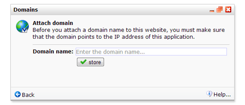

To publish web pages from the application they need to have a correct
domain set.

The function to set these items is found in **Website menu**, because
publishing is always done for an entire website rather than loose pages.

The domain of your choosing must have a CNAME pointing to
*publisher.copernica.com*. To do this you need access to your domain DNS
settings. Contact your system administrator if you do not have access or
if you don't know what this is all about. 

Learn more about making CNAME records on the [Google Help
pages](http://support.google.com/blogger/bin/answer.py?hl=en&answer=58317).

**Note:** after making the CNAME it may take some time before the domain
to take into effect. Usually a few hours, but in some cases up to 48
hours. 

Link the (sub)domain to your website
------------------------------------

Once you have set up the CNAME for the domain, the website needs to be
linked to the domain. This is done in **Websites**. Select the website
you wish to link up to the domain and choose **domain** from the Website
menu.

Choose **new domain **and enter the domain name (without *http://*).
Click store.

### View your website in browser

After storing, you can view your website in your internet browser. To
see an individual page, enter your web address, followed by the name of
the page in the browser address bar.

> **Example:**
>
> *http://www.yourdomain.com/namewebpage*
