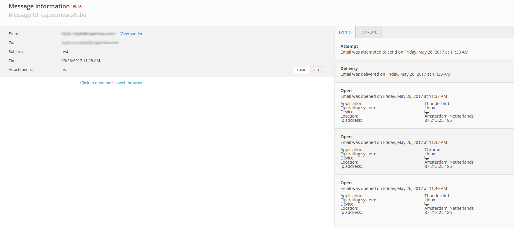

# Logfiles in MarketingSuite

Copernica keeps a log of all sent messages. We keep data on *events*: deliveries, clicks, opens, retries, etc. These log files can be retrieved through the [REST API](https://www.copernica.com/en/documentation/rest-get-logfiles), but the MarketingSuite also has an interface for it. You'll find it under the 'Operations Log' tab in the left menu.

The 'Operations Log' tab allows you to see the log files of all messages on a specific day. The files are sorted by application (MarketingSuite or Publisher) and type (click, delivery, etc.). Clicking on one of the categories will show the mailings of that day, specified by their destination ID, and some other information.

## Message information
The destination IDs of messages are clickable. Click one, and you'll get to the Message Information screen. Here, you'll find all the details on the message, such as the full content of the message, recipient, subject, attachments, and more.

Next to the mailing itself are two tabs: 'Events' and 'Template'. 'Events' shows the full details on every event that occurred with the email, like the exact time it was opened, on what device and which operating system was used.

'Template' holds information on the template that was used, like its ID and how many times it has been used.

## Downloading log files
It is possible to download log files to your computer using the 'Download' button in the Operations Log. Another way of retrieving log files is through the [REST API](https://www.copernica.com/en/documentation/rest-get-logfiles), or to get notified of events using [feedback loops](https://www.copernica.com/en/documentation/feedback-loops).
