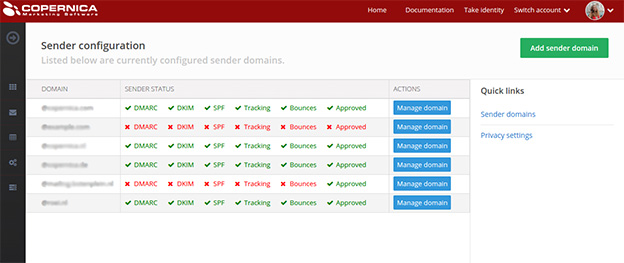
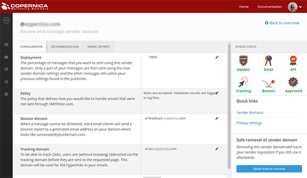

Copernica's software now offers the possibility of setting up something
we call Sender Domains. This is a useful tool that makes configuring
Copernica software a lot easier. The only thing you have to do is
provide the domain you want your e-mail to be sent from, and the Sender
Domain wizard will automatically tell you what to put in your DNS record
in order to smooth out your mailings as much as possible. On top of
that, the wizard checks whether you've entered its recommendations
correctly and warns you if that is not the case. This makes configuring
Copernica software a lot easier and decreases the chance of failure
through incorrect settings.

Before Sender Domains, your DNS record was your own responsibility.
Users had to host their own public DKIM keys, SPF records and DMARC
records and set up their own click and envelope domains, as well as
making sure all used domains are in alignment. That sounds like a
terrible hassle, which is. On top of that, these settings need to be
regularly updated, such as rotating your DKIM keys, which is something
many people forget.

Configuring a Sender Domain makes all of this much easier. Now,
everything can be found in the same spot, and you only need to configure
your domain once. After you've done that, Copernica checks whether
you've done everything right and keeps your settings up-to-date so you
don't have to worry about them afterwards.

Domain alignment and deliverability
-----------------------------------

Another advantage of using Sender Domains is that all domain names in
your mailings are automatically in alignment. By 'in alignment' we mean
that everything you send, including from-addresses (visible to the
recipient), envelope addresses (where bounces and other automatic
replies get sent to) and hyperlinks, is inherently recognizable as being
yours, because they all carry the same domain name. For example. if you
send a mailing with from-address “info@example.com”, the envelope
address of that mailing could be “messageid@feedback.example.com”.

Hyperlinks are also taken care of: if you want to use, for example, a
tracking domain to track clicks on images, the user will be redirected
through a link that's in alignment with the from-address, like
“clicks.example.com/path/to/file”.

Alignment is important. Many inbox providers prefer mailings with
aligned domains. When the envelope address, the from-address and the
hyperlinks in an e-mail all point to different domains, mailings can
look suspicious to ESP's, which may cause it to be marked as spam.

In this example, we've used “feedback.example.com” and
“clicks.example.com” to track bounces, clicks and opens. You, however,
don't have to use these subdomains. If you prefer using other
subdomains, you can set them up using the Sender Domain tool in the
Copernica software.

Automatic DKIM rotation
-----------------------

Although it's often forgotten or simply not being done, private keys for
DKIM signatures need to be replaced from time to time for security
reasons. Rotating your keys is something that must be done with caution,
because due to caching, it can take a long time before all DNS servers
in the world are updated with your new keys. On top of that, old keys
need to stick around for a little while so delayed deliveries can still
be verified using the old keys they were sent with.

When you use Sender Domains, your keys are automatically rotated every
month. New keys are put in the DNS on time and old ones get deleted
after a while.

DMARC reports
-------------

Some e-mail providers (like Gmail, Microsoft and Yahoo!) send out a
DMARC report one or multiple times a day. This report holds an overview
of all IP addresses that used your domain to send e-mail. It also tells
you whether they were valid IP addresses and whether the messages they
sent came with a DKIM signature. When you use Sender Domains, these
reports are received and processed by Copernica, and you can view them
in your Dashboard.

These DMARC reports can be very useful: first of all, they allow you to
see whether your configuration is in order. If mail is being sent
without a DKIM key or sent from an IP address that's not yet in your
SPF, you can change your configuration adequately. They also reveal when
and where your domain is being abused. If mail is being sent from an IP
address that's not yours, you know somebody's sending out e-mail
pretending to be you, which requires adequate action as well.

Sender Domains behind the scenes
--------------------------------

As stated before, you only need to add some records to your DNS once,
and Copernica takes it from there. “But how can Copernica access my DNS
settings?” is what you may be thinking now. Well, we use a nifty little
trick for that. When you configure a Sender Domain using the settings
the Copernica software gives you, you're really just adding some links
from your DNS to Copernica's DNS. We already have all relevant SPF,
DKIM, DMARC, A and MX records and all relevant configuration options.
So, you don't create your own records anymore, you're just pointing
everything that hits your DNS to the records on our servers.

We may not be able to change anything on your servers, but we can change
ours. So, when you use our servers for your settings, we can do stuff
for you, such as rotating your DKIM keys and generally managing all of
your settings.

How do I set up Sender Domains? {#how-do-i-set-up-sender-domains?}
-------------------------------

To configure a Sender Domain in Copernica Marketing Suite, click
'Configuration' in the left menu and then 'Setup sender domains'.

This image shows the overview of your Sender Domains and which aspects
of them are correctly set up and which aren't. In the right top corner,
you'll see a button that says 'Add sender domain'. This is where you'll
find the setup wizard. Click 'Manage domain', and you'll see the
following:

This is where you manage your domains. Among other things, you can edit
your subdomains and deployment rate here. Once you've got all of that
set up the way you want to, you can apply your DNS settings and start
sending email with your Sender Domain.

We'll end with a small warning: If you've been sending mailings for a
long time and in large volumes, suddenly changing your envelope address
or hyperlink domain may catch their attention. Although the new Sender
Domain settings are likely just as good or even better than your old
settings, it could happen that automatic scripts get blocked by the big
e-mail providers because sudden change can be a sign of malicious
intentions. To solve this issue, we've added the possibility to
gradually increase the percentage of mailings that are sent out with the
new settings, so your recipients can slowly get used to your new style.
You could, for example, start off with just 10% of your mailings being
sent with Sender Domain settings.
