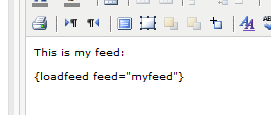

# Personalization functions: loadfeed

With the loadfeed function you can simply load feeds in your emails
or webdocument. It's possible to load in a feed you've made in the
content section or just a feed that's curated and hosted somewhere else.

Syntax and use
--------------

You can load a feed in from the *content* section, just like this:
`loadfeed feed='address from the feed'}`

Substitute *name* with the address from the feed. Again, you can find 
this in the content section inside Copernica. You can extract the 
address by going into the content section and clicking on the feed you 
want to use. You'll see an Atom as well as a RSS version you can use. 
In Copernica publication they can be used both.

Load in external feeds
----------------------

Of course it's also possible to publish external RSS and atom feeds
in yout documents: 

`{loadfeed feed='http://www.example.com/feed/feed.xml'}`

Substitute *loadfeed feed='http://www.example.com/feed/feed.xml*
with the address (URL) that has been publiced somewhere else.

*Image: Load feed tag in the text block rich text editor*

Extra options
-------------

The loadfeed has additional properties, like xlst for example.
You can use *xlst=* to get yourself an own XLST (and use it for 
your feed). The default option relies on the standardized XSLT, 
which comes with the software.

`{loadfeed feed='name' xlst='name of xlst'}`

Substitute *name of xlst* with the name of the Style component in 
the MarketingSuite.

`{loadfeed feed='address' xlst='address from xlst'}`

Substitute *address from xlst* with the actual location of the XLST,
for example: 'http://example.com/feed.xsl'

Selecting a feed in a text block
--------------------------------

On top of all previous mentioned options, you can also publish a 
feed without having to remember the tag or name of the feed. In 
every text block there is a possibility to incorporate special
content such as: webforms, RSS and Atom feeds. When in a specific 
text block, specify the type of publication and select in the list
the prefered item. Optionally you could also choose a XLST. Note
that the publication substitutes the content that is already in
the text block.

## More information

* [Personalization](./personalization)
* [Personalization functions](./personalization-functions)